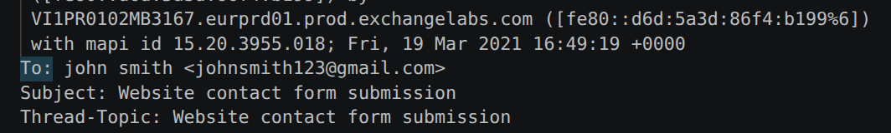
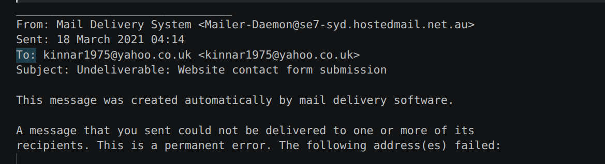
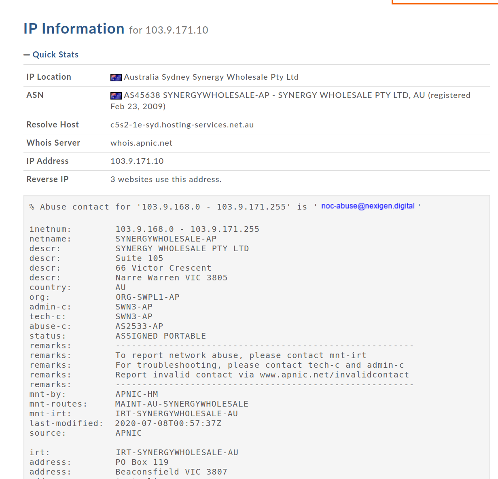
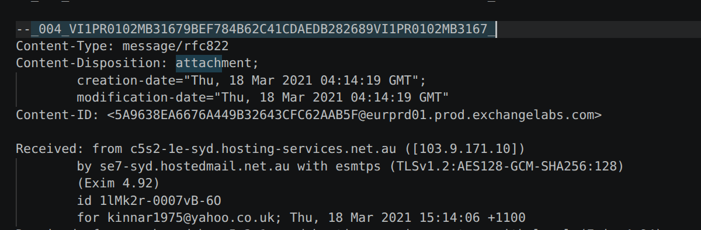
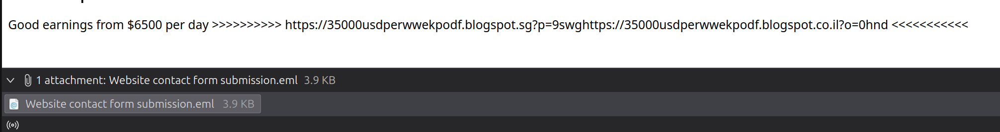
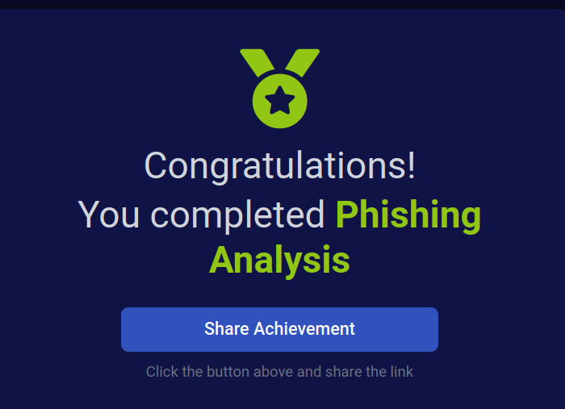

# Phishing Analysis
#### Сценарий
Пользователь получил фишинговое письмо и переслал его в SOC. Можешь исследовать письмо и вложение, чтобы собрать полезные артефакты?

Нам дан файл с расширением `.eml`. Это файл с сохраненным email-письмом в сыром виде.

### Задание 1
Кто является основным получателем этого письма?

Ответ: 

Если смотреть на сырой вид письма, то можно увидеть два, в целом, подходящих поля: `Delivered-To:` и `To:`.
- Поле `Delivered-To` - показывает, в какой почтовый ящик письмо реально отправилось
- Поле `To` - а это поле означает, кому письмо было адресовано отправителем.

По смыслу задания, естественно, подходит поле `To:`.

Окей, с этим разобрались. Но отображается несколько полей `To:`. Какое по итогу нужно?

Если вспомнить сценарий, а именно: `Пользователь получил фишинговое письмо и переслал его в SOC`. То становится понятно, что нужно поле из вложенного письма.

### Задание 2
Какая тема у этого письма?

Ответ:

Тема письма указана в заголовке `Subject:`. 

### Задание 3
В какие дату и время было отправлено это письмо?

Ответ:

Дату и время отправки можно посмотреть в поле `Sent`.

### Задание 4
Какой исходный IP-адрес?

Ответ:

Нам нужно посмотреть поле `X-Originating-IP`. Оно как раз и отвечает за исходный IP, т.е. IP-адрес системы/сервера, откуда письмо было отправлено. 

### Задание 5
Выполни обратный DNS-запрос для этого IP-адреса. Какое имя хоста было получено? 

Ответ:

Предположу, что обратным DNS-запросом мы хотим получить имя сервера, который отправил письмо.
Заходим на сайт `whois.domaintools.com` и вбиваем найденный ранее IP:

### Задание 6
Как называется прикреплённый файл?

Ответ:

В сыром письме название файла не указано.

Поэтому попробуем узнать название через почтовый клиент:

### Задание 7
Какой URL найден внутри вложения?

Ответ:

На скрине выше указан.

### Задание 8
На каком сервисе размещена эта веб-страница?

Ответ:

Нужно посмотреть на URL-адрес в вложении, и прогуглить, чем является blogspot[.]sg

### Задание 9
Используя URL2PNG, какой заголовок отображается на этой странице? (Неважно, если страница уже недоступна!)

Ответ:

Что вообще такое URL2PNG? URL2PNG — это сервис, который делает снимок сайта по URL, то есть превращает веб-страницу в картинку.

*Congrats me!*

