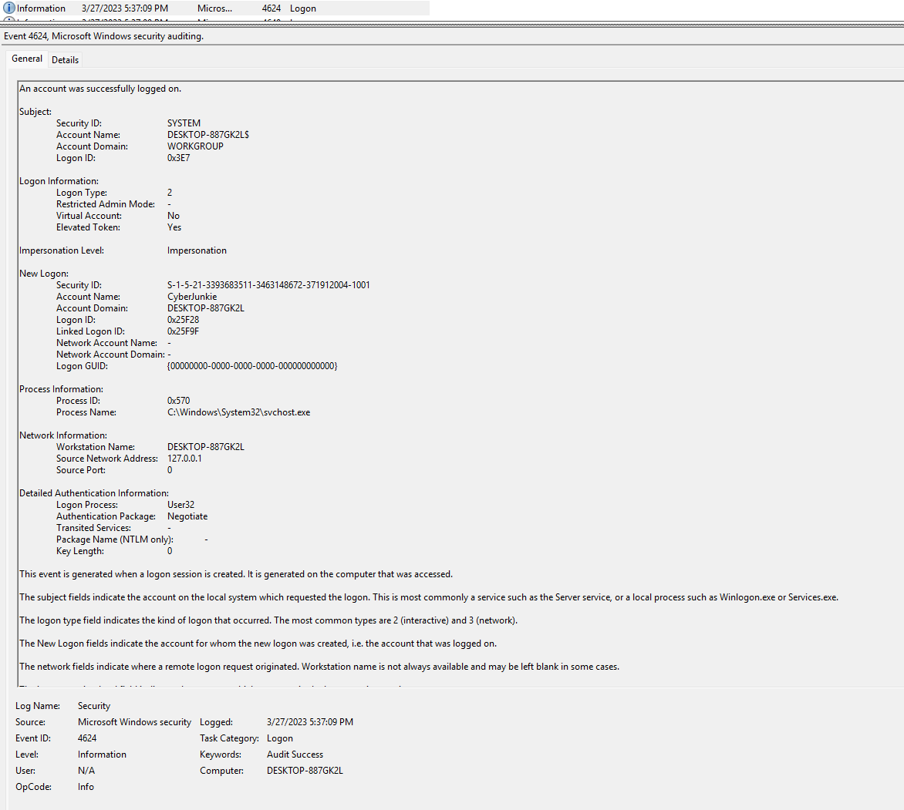
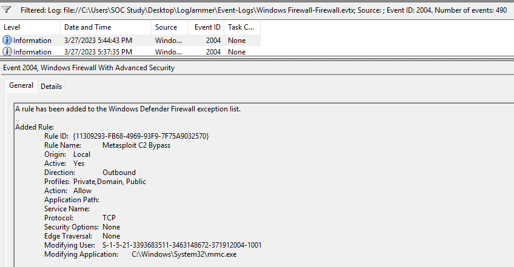
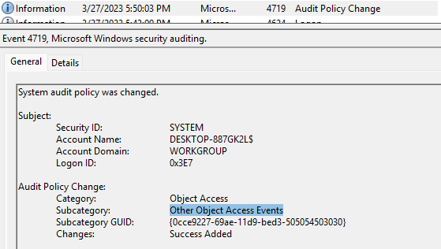
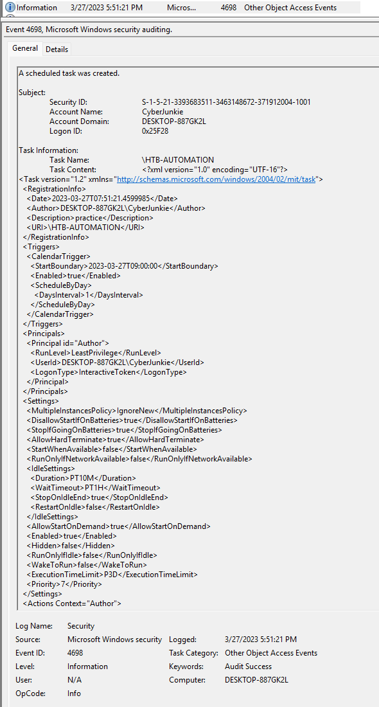
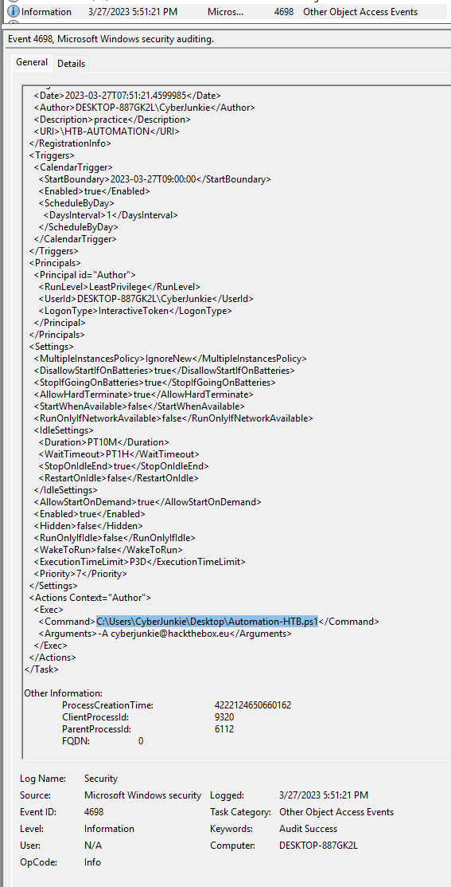
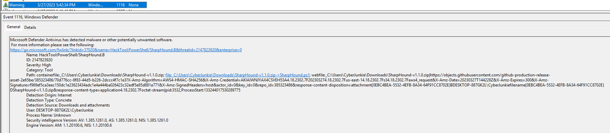
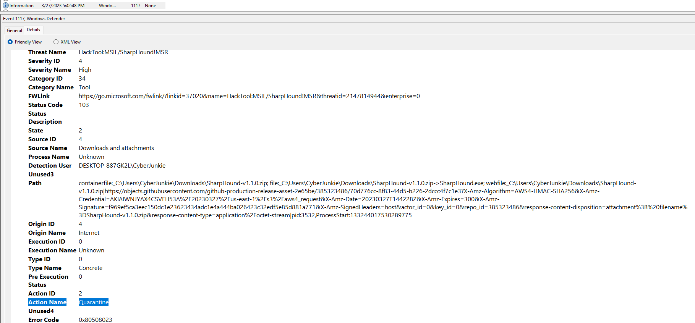
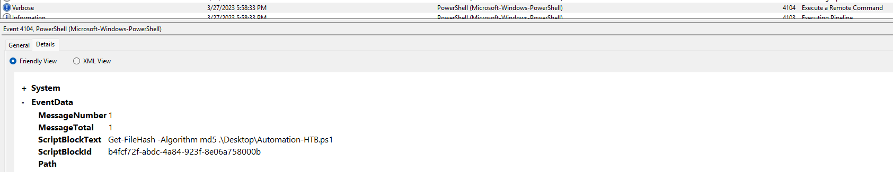
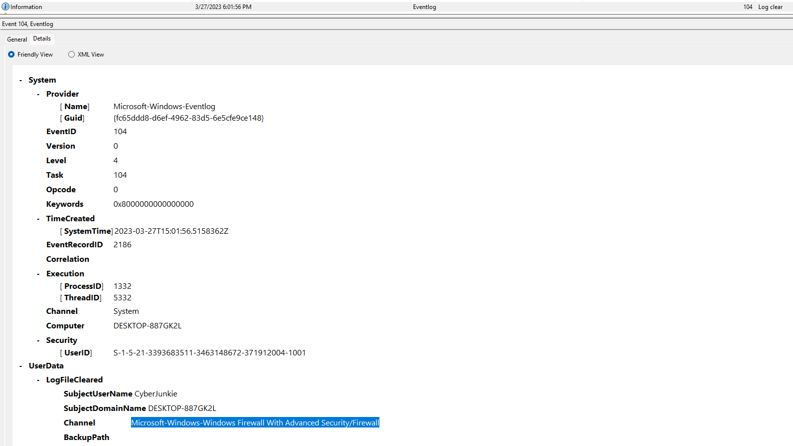
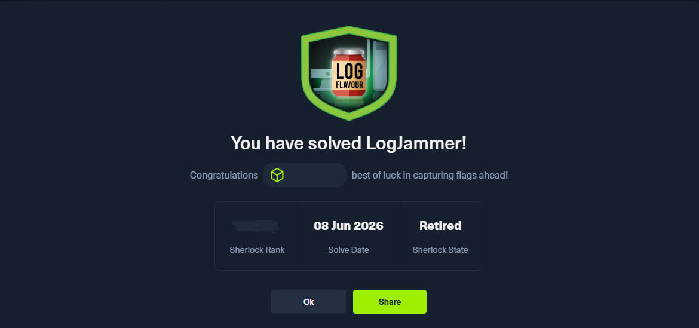

### Сценарий
Тебе предоставили возможность работать младшим DFIR-консультантом в крупной консалтинговой компании. Однако для этого они дали тебе техническое задание, которое необходимо выполнить.
Консалтинговая компания Forela-Security хочет оценить твои знания в области анализа журналов событий Windows. Пожалуйста, проанализируй предоставленные материалы и дай ответы на поставленные ими вопросы.

### Задание 1
Когда пользователь cyberjunkie впервые успешно вошёл в свой компьютер? Укажите время в UTC.

Ответ:

Нужно найти успешный вход, значит буду смотреть события с ID 4624. Также стоит обратить внимание на поля `Logon  Type` и `Account Name`. 
Интересующий нас вход был выполнен в 03/27/2023 5:37:09. 
Для дальнейшего расследования также зафиксирую значения:
- Учетку, под которой был выполнен вход: `Account Name = CyberJunkie`
- Идентификатор сессии пользователя: `Logon ID = 0x25F28`
- Что у пользователя есть повышенные права: `Elevated Token = Yes`

### Задание 2
Пользователь изменил настройки брандмауэра в системе. Проанализируйте журналы событий брандмауэра и определите: какое имя правила брандмауэра было добавлено?

Ответ:

Ранее определил, что вход пользователя был 3/27/2023 5:37:09, значит нужно искать события после этого времени.
Так как в задании указано, что было именно добавление правила, то нужно вести поиск по событию 2004.

Взгляд зацепился за название правила `Metasploit C2 Bypass`. Так как Metasploit - это программа, предназначенная для поиска уязвимостей в сетях и ОС. Фиксирую, что правило было добавлено в 5:44:03. 

### Задание 3
Какое направление было у этого правила брандмауэра?

Ответ:

В описании события 2004 указано, что это правило для исходящего трафика (т.е. с устройства жертвы в внешнюю сеть).

### Задание 4
Пользователь изменил политику аудита компьютера. Какая подкатегория этой изменённой политики?

Ответ:

Изменения политик безопасности логируется в журнале Security, событие 4719. Политика аудита была изменена в 5:50:03.

### Задание 5
Пользователь cyberjunkie создал запланированную задачу. Какое имя у этой задачи?

Ответ: 

Создание запланированных задач также находится в журнале Security, событие 4698. Подходящее событие будет в рамках пользовательской сессии с id `0x25F28`:

### Задание 6
Какой полный путь к файлу был указан для запуска в этой запланированной задаче?

Ответ:

В событии 4698 есть XML-схема с описанием запланированного события, а внутри тега `Exec` указано название команды и путь до файла `C:\Users\CyberJunkie\Desktop\Automation-HTB.ps1`. 
Разрешение файла `.ps1` дает понять, что это PowerShell скрипт.

### Задание 7
Какие аргументы команды были указаны?

Ответ: 

Аргументы команды указаны в теге `Arguments`: `-A cyberjunkie@hackthebox.eu`.

### Задание 8
Антивирус, запущенный в системе, обнаружил угрозу и выполнил действия над ней. Какой инструмент был определён антивирусом как вредоносный?

Ответ:

В задании предоставлены логи от Windows Defender. В логах есть два Warning события 1116, в них Defender сообщает, что был обнаружен инструмент `SharpHound`.
SharpHound - это инструмент для сбора информации об объектах в Active Directory.

### Задание 9
Какой полный путь к вредоносному файлу вызвал срабатывание антивируса?

Ответ:

Поле `Path` с указанием конкретного пути до файла: `file:C:\Users\CyberJunkie\Downloads\SharpHound-v1.1.0.zip`.

### Задание 10
Какое действие выполнил антивирус?

Ответ:

Далее в логах Defender указано событие 1117, в котором антивирус поместил файл в карантин: `Action Name: Quarantine`.

### Задание 11
Пользователь использовал PowerShell для выполнения команд. Какую команду выполнил пользователь?

Ответ:

Также в задании предоставили логи PowerShell-Operational. Внутри них есть событие 4104, в котором была проверка хэша MD5 для файла `Automation-HTB.ps1`.

### Задание 12
Мы подозреваем, что пользователь удалил некоторые журналы событий. Какой файл журнала событий был очищен?

Ответ:

В журнале System имеется событие 104 (Log Clear). В нем указано, что был очищен файл с логами Firewall.

Congrats:
