#### Сценарий
Как внимательный охотник за киберугрозами, вы начинаете расследование с гипотезы: «Последние тенденции указывают на рост числа атак Kerberoasting в отрасли. Может ли ваша организация быть потенциальной целью этой техники атаки?»

Эта гипотеза становится основой для комплексного расследования, которое начинается с углублённого анализа журналов контроллера домена с целью обнаружения и нейтрализации потенциальных угроз безопасности.

Примечание: ваш контроллер домена настроен на аудит операций с Kerberos Service Ticket, что необходимо для расследования атак Kerberoasting. Кроме того, для расширенного мониторинга установлен Sysmon.

### Задание 1
Чтобы эффективно снизить риск атак Kerberoasting, необходимо усилить шифрование, используемое протоколом Kerberos. Какой тип шифрования сейчас используется в сети?

Ответ:

Сначала нужно понять, какие источники событий подключены и отправляют логи:
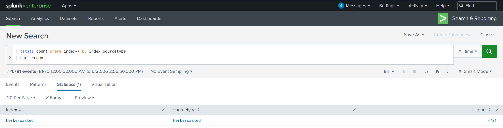

Всего один источник.
Хорошо, по заданию нам нужно узнать тип шифрования в сети, значит нас будут интересовать события Windows Event Id = 4769 с запросами TGS билетов:
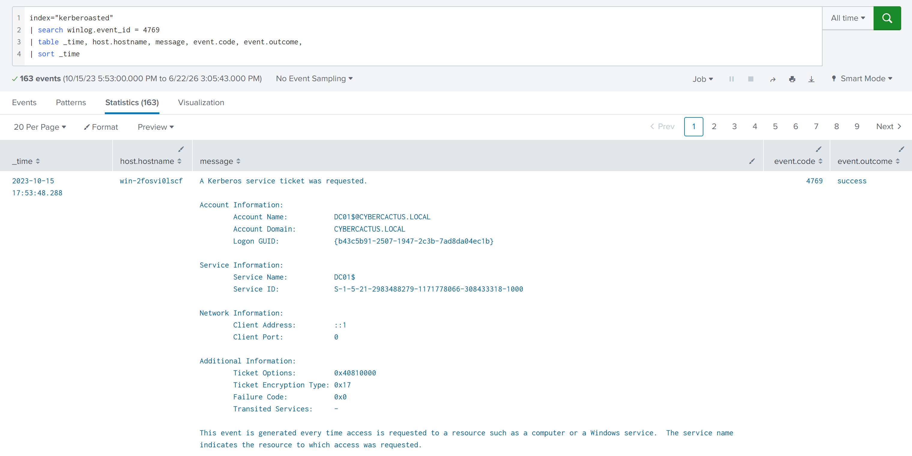

Тип шифрования указывается в поле `Ticket Encyption Type`.
Бегло просмотрев логи, можно понять, что у нас везде используется шифрование `0x17`, что соответствует RC4-HMAC (устаревший тип шифрования).
### Задание 2
Какое имя пользователя у учётной записи, которая последовательно запросила TGS билеты, для двух разных сервисов за короткий промежуток времени?

Ответ:

Для начала, нам нужно убрать из выборки события, в которых названия сервисов заканчиваются на `$`, так как это относится к техническим аккаунтам, которые используют службы Windows:
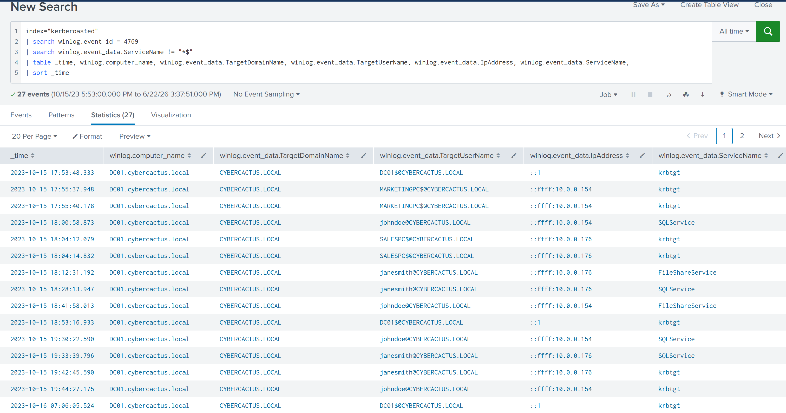

Есть 2 события от пользователя `johndoe`, считаю их подозрительными, так как разница по времени между ними составляет всего несколько миллисекунд:
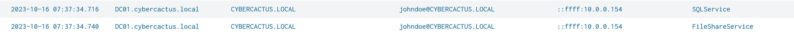

Также стоит обратить внимание на событие запроса TGS к учетке `krbtgt`(она используется для шифрования и подписи билетов TGS) от той же учетки `johndoe`, которое уже произошло в `2023-10-16 08:17:33`:
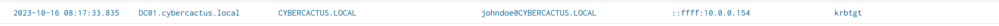

Эти события связаны с учетной записью `johndoe`. Время запроса TGS к сервисам `SQLService` и `FileShareService`: `2023-10-16 07:37:34`. 
### Задание 3
Нам нужно глубже изучить журналы, чтобы выявить возможные скомпрометированные сервисные учётные записи и провести полноценное расследование потенциально успешной атаки Kerberoasting. Укажите имя скомпрометированной сервисной учётной записи.

Ответ:

Так как ранее мы выявили запрос TGS к сервисам `SQLService` и `FileShareService`, а также точное время запроса билетов - `2023-10-16 07:37:34`, то отфильтруем события, которые связаны с этими сервисами после запроса билетов:
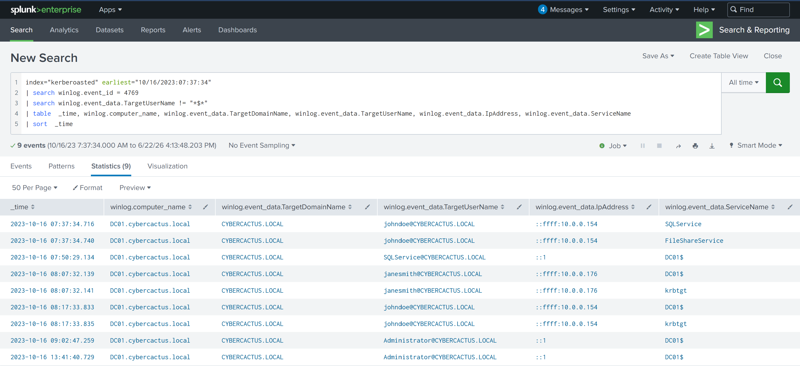

Видно, что в `2023-10-16 07:50:29` был запрос TGS от SQLService и DC01$. 
Чтобы точно убедиться в компрометации, посмотрим на события 4624 (успешного входа) для этих сервисов:
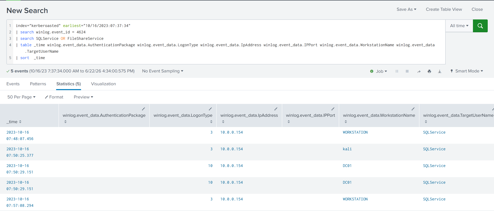

Подключения были только к `SQLService`, причем смущает, что был сетевой вход с хоста `kali` с IP `10.0.0.154`. 
### Задание 4
Чтобы отследить начальную точку входа атакующего, нужно определить машину, которая была скомпрометирована первой. Какой IP-адрес у этой машины?

Ответ:

Так как ранее мы уже определили, что запрос TGS произошел от учетки `johndoe`, то посмотрим успешные входы, связанные с этой учеткой:
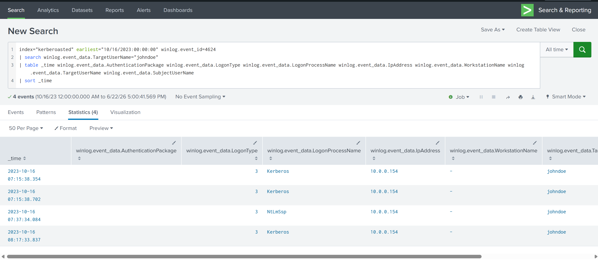

Успешный вход в учетку `johndoe` с использованием NTLM был выполнен в `2023-10-16 07:37:34`, IP-адрес скомпрометированной машины - `10.0.0.154`.
### Задание 5
Чтобы понять действия атакующего после входа с использованием скомпрометированной сервисной учётной записи, укажите: какой системный сервис был установлен на контроллере домена?

Ответ:

Установка системного сервиса логируется в событии с id 4697 или 7045, так что найдем такие события:
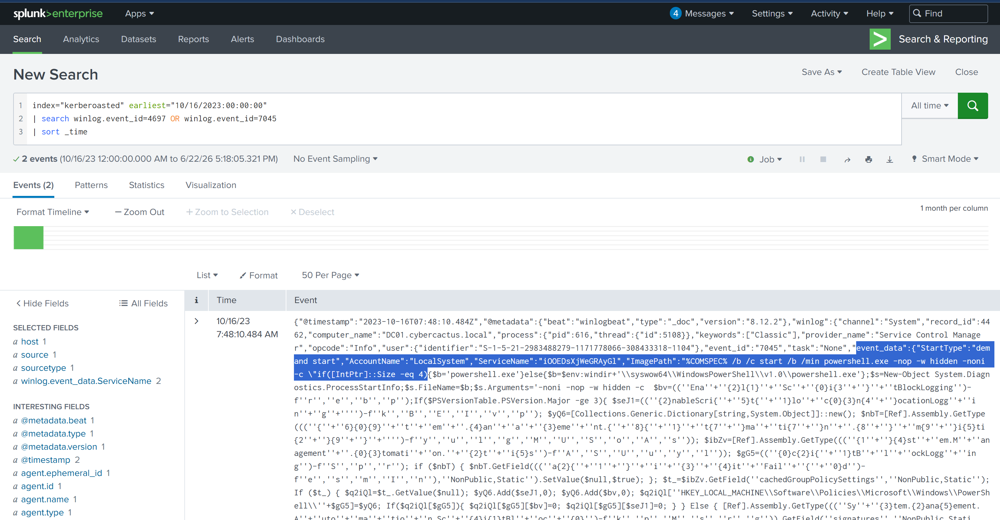

В поле ImagePath указана команда запуска powershell c обфусцированной командой.
Название сервиса: `iOOEDsXjWeGRAyGl`. 

### Задание 6
Чтобы понять масштаб намерений атакующего, укажите: полный путь к ключу реестра, в котором атакующий изменил значение для включения Remote Desktop Protocol?

Ответ:

Изменения значений реестра логируются событием Windows event id 4657 либо Sysmon 13. Также в задании указано, что изменение явно связано с RDP, это поможет сузить круг поиска:
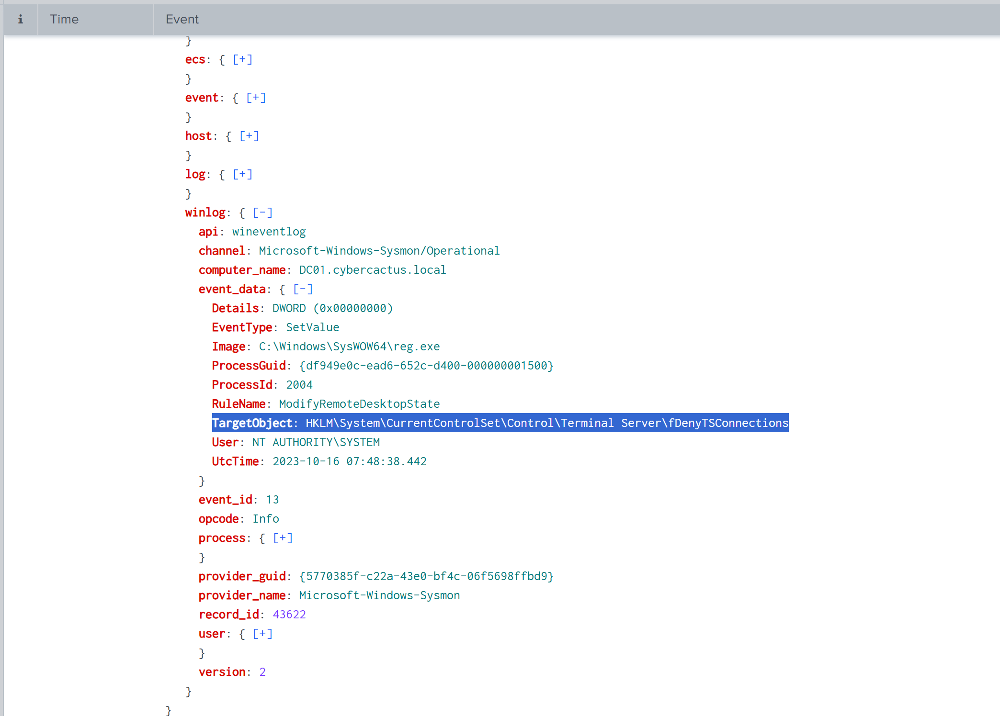

Полный путь к ключу реестра: `HKLM\System\CurrentControlSet\Control\Terminal Server\fDenyTSConnections`.
### Задание 7
Чтобы составить полную временную линию атаки, укажите: UTC-временную метку первого зафиксированного события входа по Remote Desktop Protocol, RDP.

Ответ:

Ранее мы уже находили события входа по RDP к SQLService:
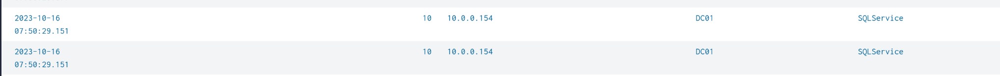

Значит точное время подключения по RDP: `2023-10-16 07:50`
### Задание 8
Чтобы раскрыть механизм закрепления, использованный атакующим, укажите: имя WMI Event Consumer, отвечающего за поддержание закрепления.

Ответ:

Есть ряд событий в Sysmon, которые отвечают за WMI - 19, 20, 21. Посмотрим информацию по этим событиям:
Sysmon 19.
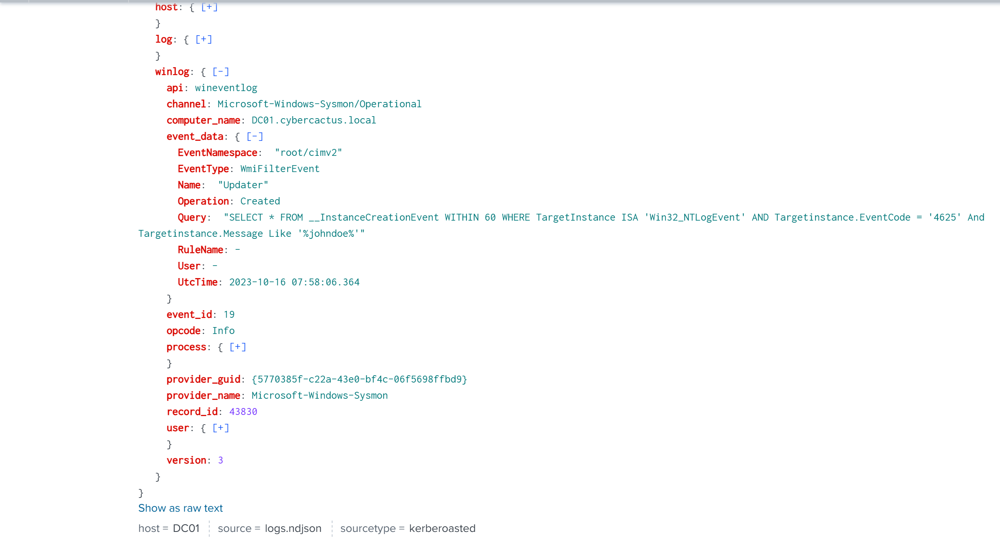

В этом событии указано, что каждые 60 секунд идет проверка появления новых событий 4625 (неудачных входов) для учетки `johndoe`. Если такое событие появляется, то срабатывает фильтр WMI.

А дальше как раз идет создание потребителя в событии Sysmon 20:
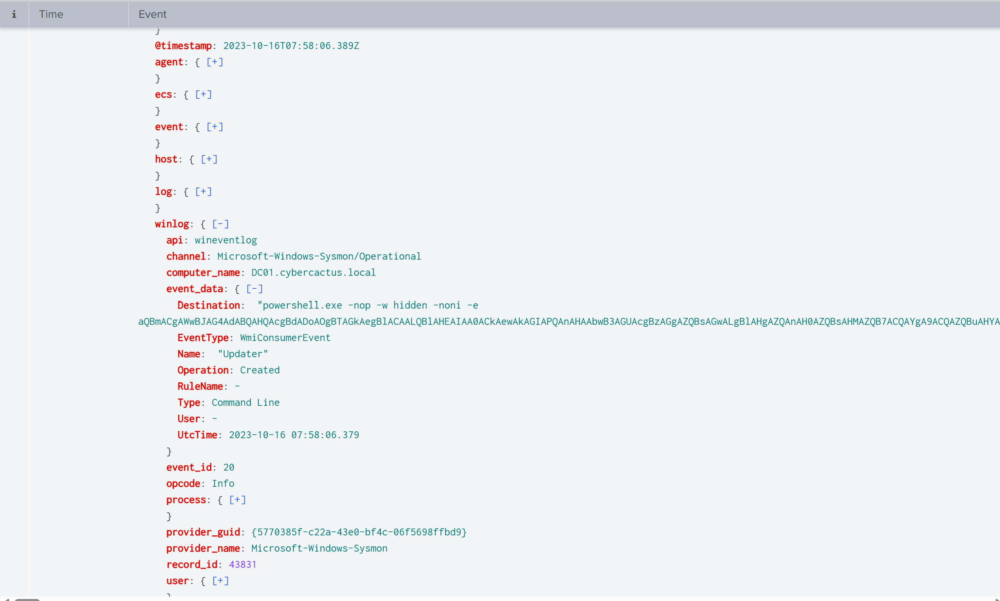

Причем указано, что по триггеру будет запуск powershell в скрытом режиме с обфусцированной командой.

Имя WMI потребителя: `Updater`.
### Задание 9
На какой класс нацелен фильтр WMI Event Subscription в обнаруженном вами WMI-триггере на события?

Ответ:

В прошлом задании мы посмотрели событие Sysmon 19, в котором явно указан целевой объект, за которым следит фильтр, значит его класс будет: `Win32_NTLogEvent`.

