#### Сценарий
После того как Карен начала работать в компании TAAUSAI, она стала заниматься незаконной деятельностью внутри компании. **TAAUSAI** наняла вас в качестве SOC-аналитика, чтобы начать расследование этого дела.
Вы получили образ диска и обнаружили, что Карен использует на своей машине операционную систему Linux. Проанализируйте образ диска компьютера Карен и ответьте на предложенные вопросы
### Задание 1
Какой дистрибутив Linux используется на этой машине?

Ответ:

Так как нам предоставили образ диска, то его разбор будем вести с помощью программы `FTK Imager`.
Чтобы найти название дистрибутива, предполагаю, что нам нужно посмотреть папку `/boot`, то есть папку, в которой находятся все файлы, необходимые для загрузки системы.
А вот и, собственно, конфигурационные файлы `Kali`:
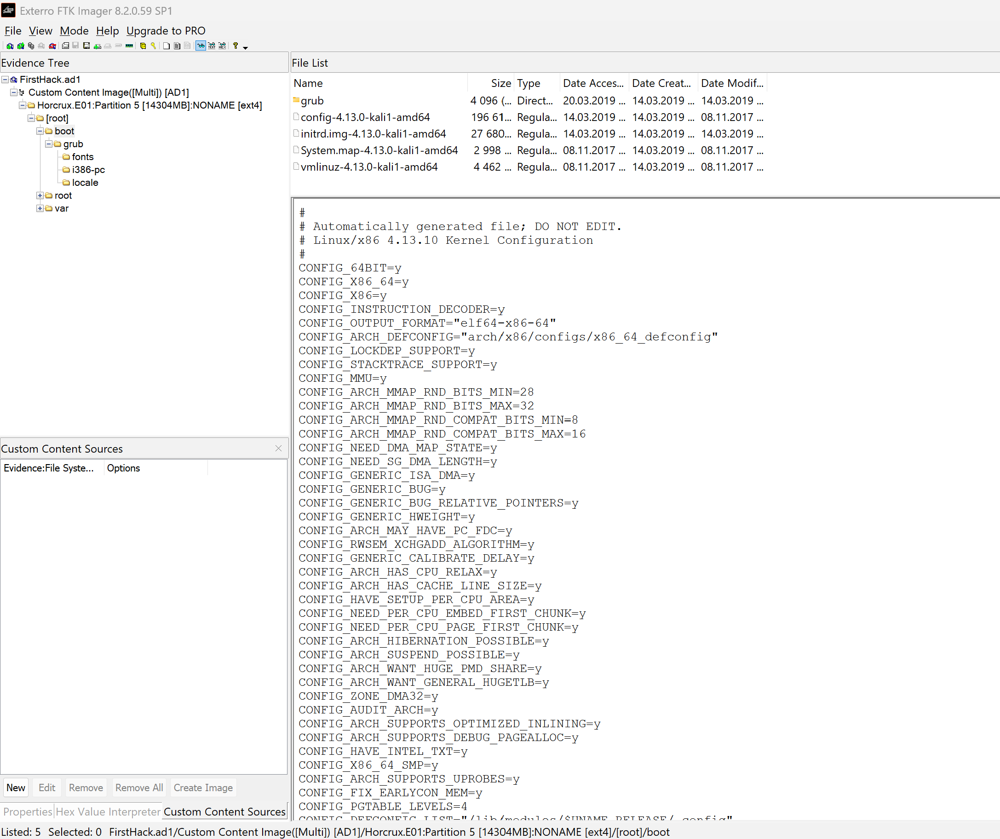

### Задание 2
Какой MD5-хэш у файла Apache access.log?

Ответ:
Логи Apache-сервера должны находиться в папке `/var/log/apache`.
Далее нажимаем ПКМ -> и экспорт хэша файла.
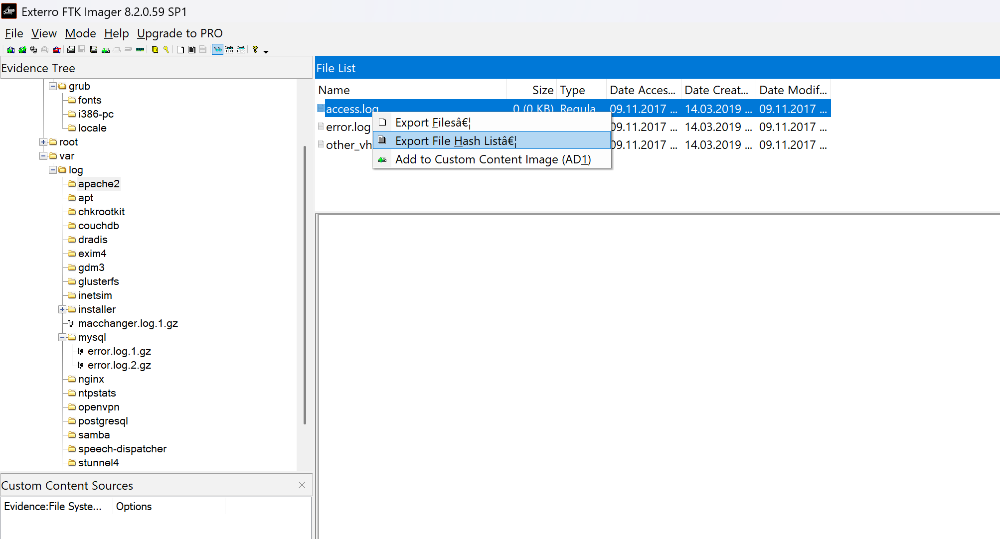

В файле отображаются MD5 и SHA-1 хэши:
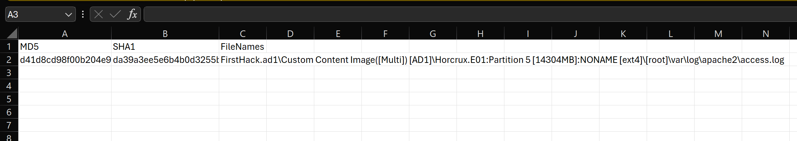

Нам нужен MD5, значит: `d41d8cd98f00b204e9800998ecf8427e`
### Задание 3
Есть подозрение, что был скачан инструмент для дампа учетных данных. Как называется скачанный файл?

Ответ:

Скорее всего файл скачивался по обычному пути, значит сначала стоит проверить папку `Downloads`:
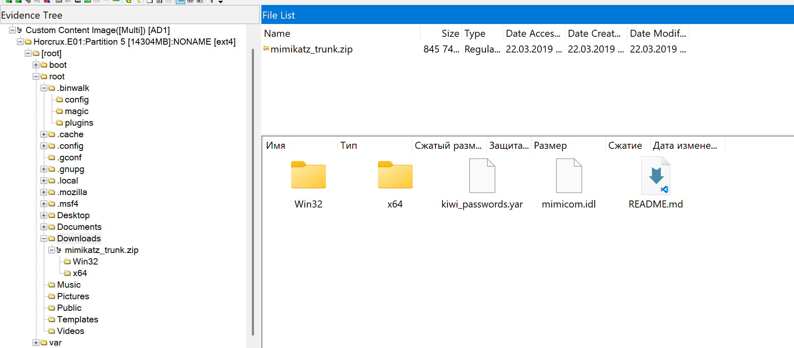

Да, был скачан популярный инструмент для получения учетных данных, он же mimikatz: `mimikatz_trunk.zip`
### Задание 4
Был создан сверхсекретный файл. Каков абсолютный путь к этому файлу?

Ответ:

Опять же предположу, что этим секретным файлом являются извлеченные данные учеток, которые были получены через mimikatz.
Проверю сначала рабочий стол, возможно файл был сохранен туда:
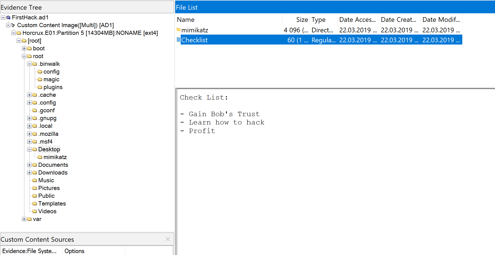

На рабочем столе находится записка `Checklist` (с целями злоумышленника?) и распакованный mimikatz.
Проверю остальные папки: `Documents`, `Music`, `Pictures`, `Public` и так далее, возможно в них что-то есть.

В `Documents` лежит папка `myfirsthack`:
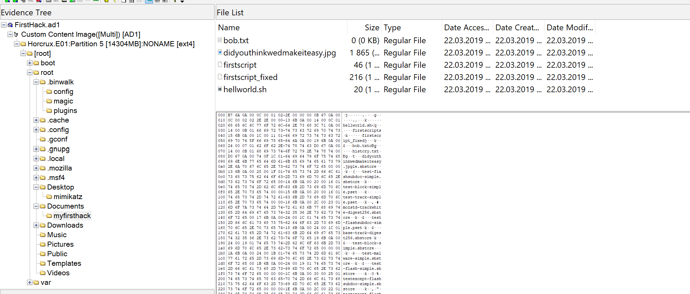

Внутри находится 3 bash-скрипта, txt-файл и jpg-картинка. Сначала посмотрим bash-файлы:
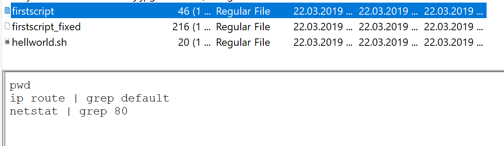
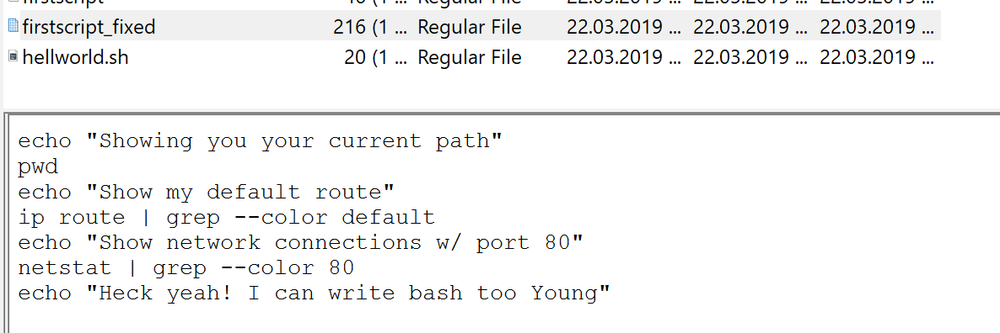

Скрипт `firstscript_fixed` показывает текущую рабочую директорию, шлюз по умолчанию для выхода в сеть и сетевые соединения по 80 порту.
Не думаю, что это сверхсекретные файлы.

В `Pictures` находится один файл - `keys.txt`:
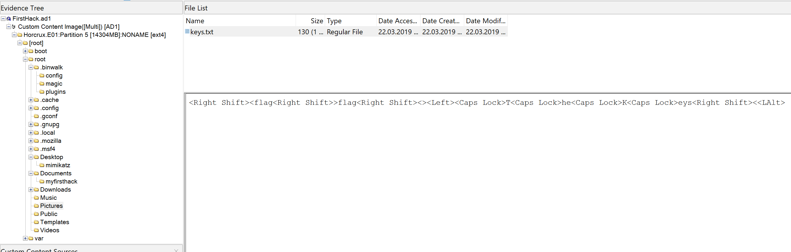

Окей, если было создание файла, значит это событие должно было логироваться. Посмотрим `bash_history`:
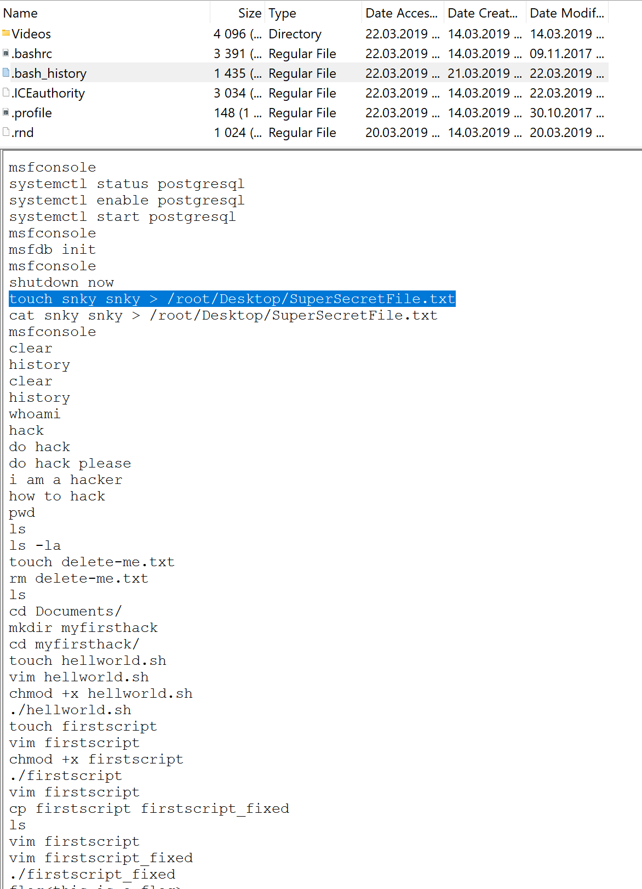

"Супер-секретный файл": `/root/Desktop/SuperSecretFile.txt`
### Задание 5
Какая программа использовала файл `didyouthinkwedmakeiteasy.jpg` во время своего выполнения?

Ответ:

Просматривая дальше файл `bash_history`, видно, что этот файл использовался программой `binwalk`:
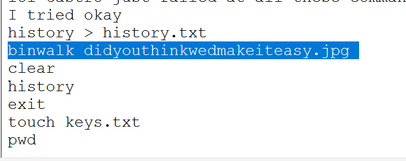

### Задание 6
Какая третья цель указана в чек-листе, который создала Карен?

Ответ:

Ранее на рабочем столе был найден файл `Checklist`, третий пункт в нем: `Profit`.
### Задание 7
Сколько раз запускался Apache?

Ответ:

Логи Apache пустые, значит он не запускался:
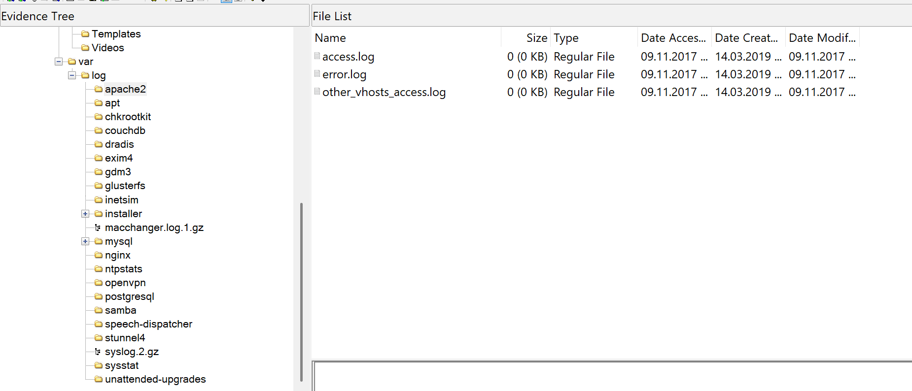
### Задание 8
Эта машина использовалась для атаки на другую машину. В каком файле содержится доказательство этого?

Ответ:

В root-директории находится изображение, на котором виден запуск `aylmao.exe`:
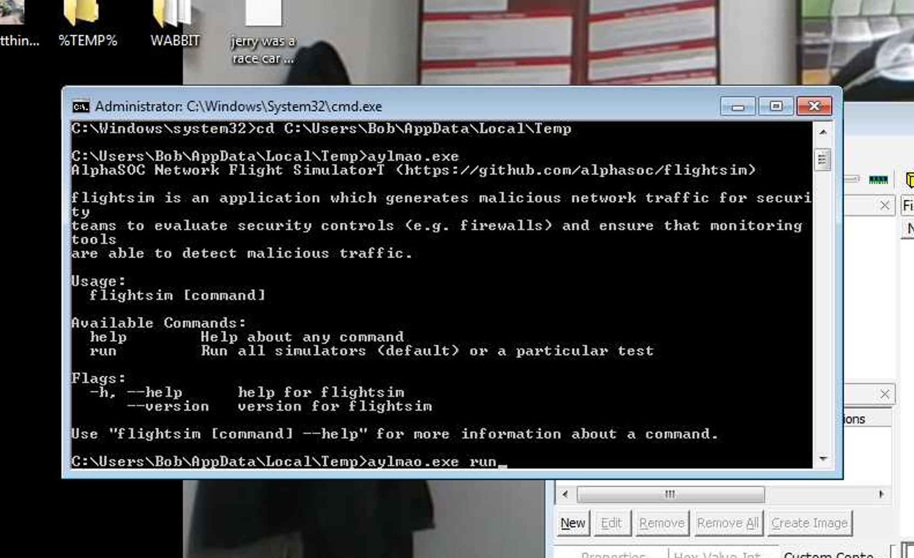
### Задание 9
Считается, что Карен насмехалась над другим компьютерным экспертом с помощью bash-скрипта в директории Documents. Над кем именно она насмехалась?

Ответ:

Она насмехалась над `Young`:
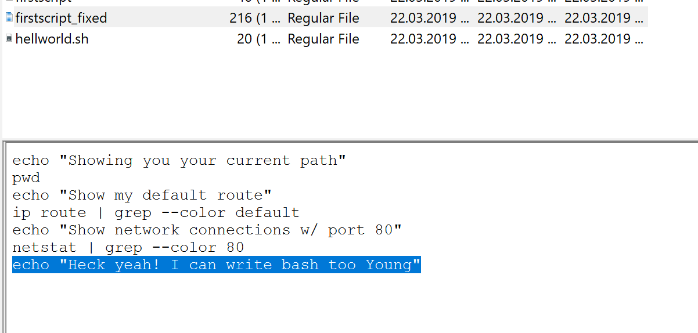
### Задание 10
Пользователь несколько раз выполнял команду su, чтобы получить root-доступ, в 11:26. Кто был этим пользователем?

Ответ:

Использование команды `su` будет находиться в логах безопасности(`auth.log`). Так как нам дали точную метку времени, но проведем поиск по этому времени:
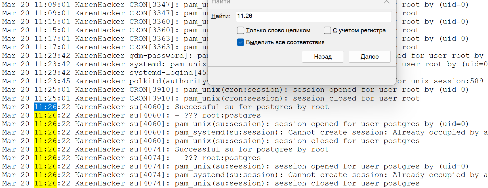

Это был пользователь `postgres`.

### Задание 11
Судя по истории bash, какая текущая рабочая директория?

Ответ:

Нужно смотреть по команде `pwd`:
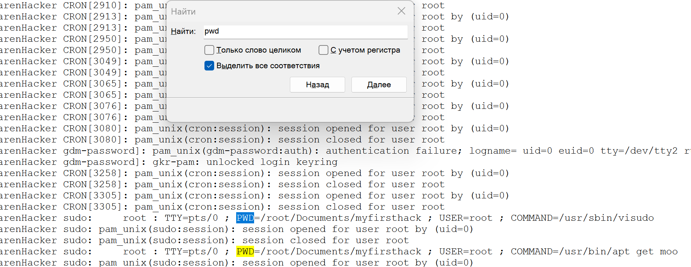

Рабочая директория: `/root/Documents/myfirsthack/`.

