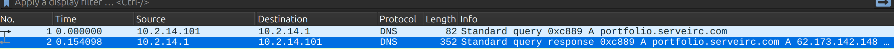
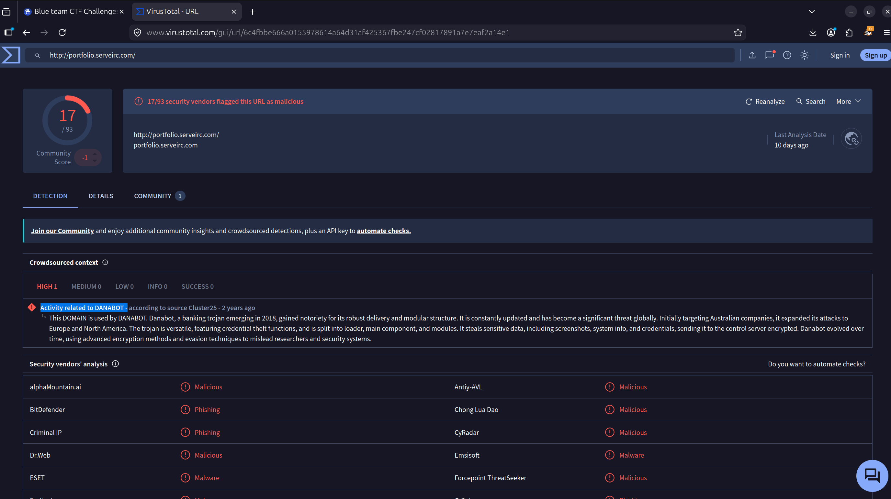
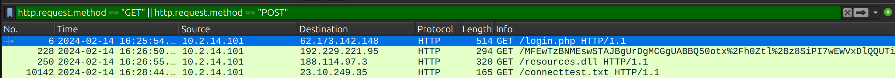
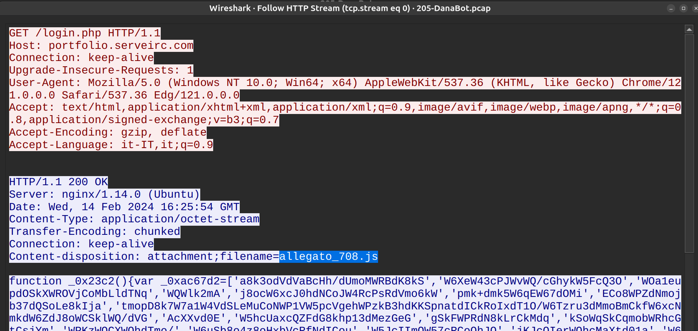
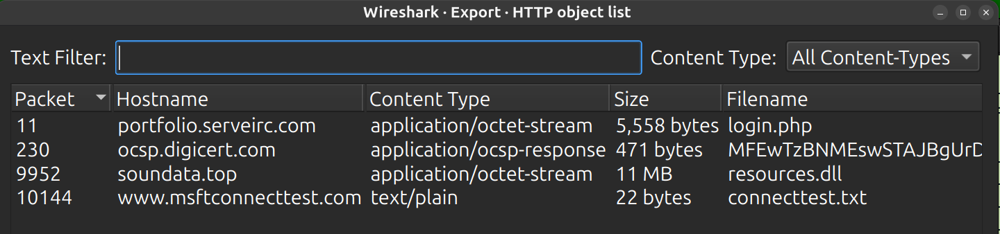
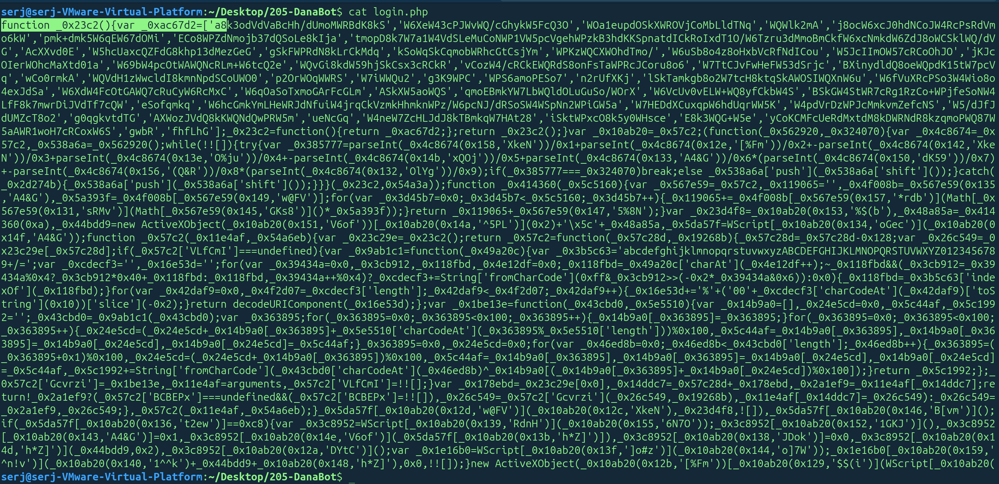
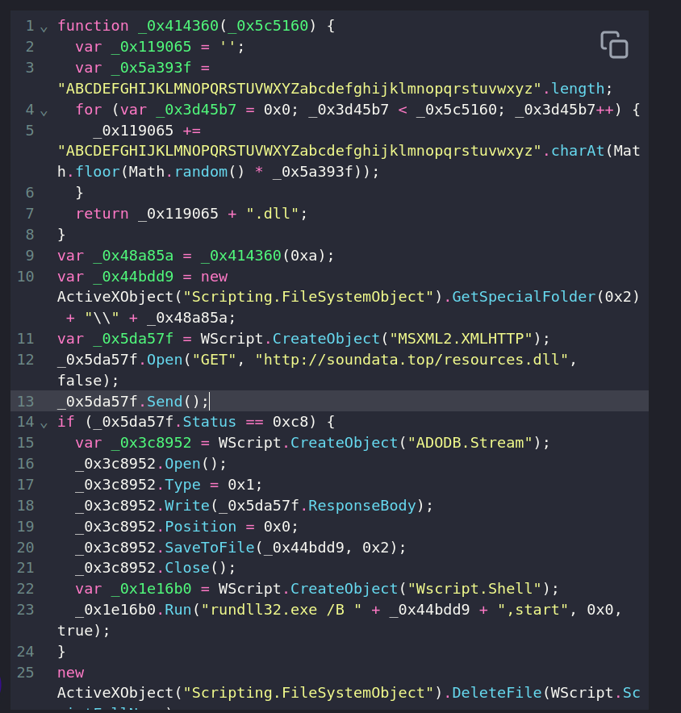
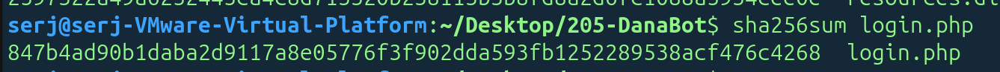
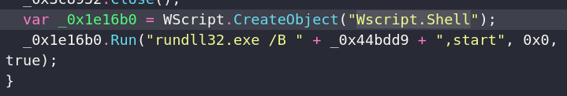
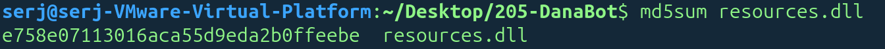

# DanaBot Lab
### Сценарий
Команда SOC обнаружила подозрительную активность в сетевом трафике, которая указывает на компрометацию одного из компьютеров. Конфиденциальная информация компании была похищена.

Ваша задача — использовать файлы сетевого захвата трафика PCAP и данные Threat Intelligence, чтобы расследовать инцидент и определить, каким образом произошла компрометация.

### Задание 1.
*Какой IP-адрес использовал злоумышленник при первоначальном доступе?*

Ответ:

Открываем файл и сразу видим запрос на разрешение домена с типом записи *A*, то есть сопоставление доменного имени с IPv4-адресом.

Проверим домен через VirusTotal:

### Задание 2.
*Как называется вредоносный файл, использованный для первоначального доступа?*

Ответ:

Фильтруем записи по протоколу http с методом POST или GET.

Далее смотрим, что вернулось в ответе через `Follow -> HTTP Stream`:

В Content-Type указан application/octet-stream. 

Что значит *octet-stream*? 
Это универсальный MIME-тип для файла, тип которого сервер явно не уточняет.

**Второй способ** узнать, какие файлы были загружены:

`File -> Export Objects -> HTTP`

Просмотрим файл login.php:

Видно название какой-то функции, остальной код обфусцирован.
Соответственно, выполняем деобфускацию:

После разбора кода, становится ясно, что это вредоносный JavaScript для Windows, который скачивает DLL-файл, сохраняет его во временную папку, запускает через `rundll32.exe`, а затем удаляет сам себя.

### Задание 3.
*Какой SHA-256-хэш у вредоносного файла, использованного для первоначального доступа?*

Ответ: 

Для этого используем встроенную функцию `sha256sum`:

### Задание 4.
*Какой процесс использовался для выполнения вредоносного файла?*

При просмотре деобфусцированного кода можно было заметить:

Wscript.Shell - Windows Script Host, является интерпретатором `.js` файлов по умолчанию в системах Windows.

### Задание 5.
*Какое расширение файла имеет второй вредоносный файл, использованный злоумышленником?*

Ответ:

Файл, который загружается с помощью скрипта - resources.dll

### Задание 6.
*Какой MD5-хэш у второго вредоносного файла?*

Ответ:

Для этого используем встроенную функцию `md5sum`:

